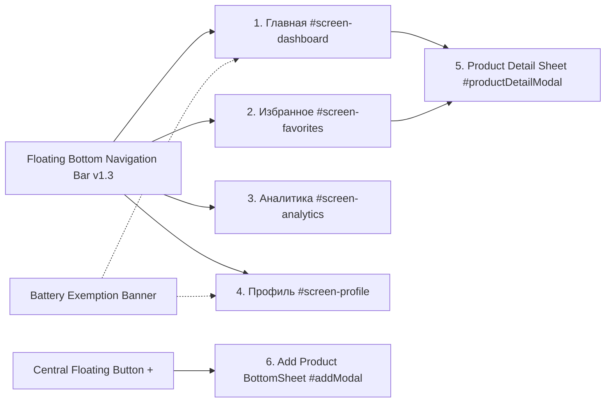
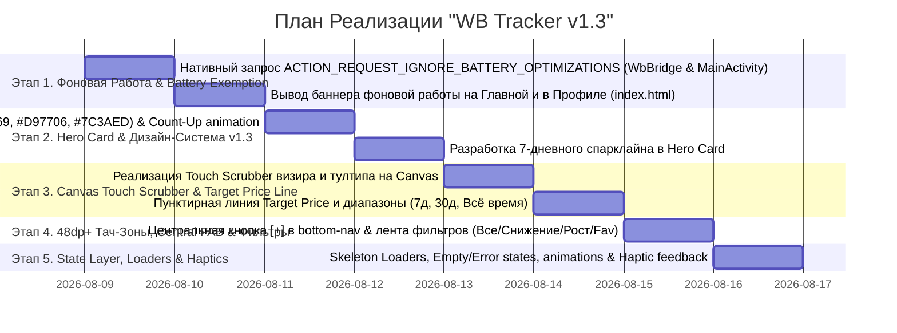

# Архитектурный План и Техническое Задание: Пульс — WB Tracker (v1.3)

> **Версия спецификации:** 1.3.0 ("WB Tracker v1.3: Гарантированное Фоновое Обновление 24/7, Hero Card с Анимацией Count-Up, Интерактивный Canvas-График с Touch Scrubber, 48dp+ Эргономика и State Layer")  
> **Статус:** Одобрено Ведущим Инженером по Системной Интеграции и Советом Инженеров  
> **Целевая платформа:** Android (Kotlin, WebView Chromium, SQLCipher Encrypted Room, WorkManager, Hilt, OkHttp, HTML5 Canvas)  
> **Проект:** `wbtracker` (`/home/yura/projects/wbtracker`)

---

## 🏛️ 1. Общий Обзор Системы и Архитектура v1.3

Приложение **"Пульс — WB Tracker"** реализует гибридную 3-звенную архитектуру с разграничением ответственности: **View-Only HTML5/CSS3/JS фронтенд**, **Kotlin Вычислительный Бэкенд** ([`WbBridge.kt`](file:///home/yura/projects/wbtracker/app/src/main/kotlin/com/wbtracker/app/bridge/WbBridge.kt), [`ProductRepositoryImpl.kt`](file:///home/yura/projects/wbtracker/app/src/main/kotlin/com/wbtracker/app/data/repository/ProductRepositoryImpl.kt), [`WbApiService.kt`](file:///home/yura/projects/wbtracker/app/src/main/kotlin/com/wbtracker/app/data/remote/WbApiService.kt)) и **зашифрованное хранилище SQLCipher Room** с **механизмом автоматической саморегенерации**.

В версии **v1.3** реализован комплекс фундаментальных улучшений фоновой работы, интерактивности графиков и визуального интерфейса:
1. **Гарантированное фоновое обновление цен 24/7**: нативный запрос игнорирования оптимизации батареи Android (`ACTION_REQUEST_IGNORE_BATTERY_OPTIMIZATIONS`), проверка через `PowerManager`, динамические методы `WbBridge.isBatteryOptimizationIgnored()` и `WbBridge.requestBatteryOptimizationExemption()`, предупреждающие баннеры на Главной и в Профиле.
2. **Дизайн-система v1.3 и обновленный Hero Card**: крупный заголовок совокупной экономии с плавным анимационным эффектом count-up, миниатюрный 7-дневный спарклайн-график и жесткая семантическая палитра: Зеленый `#059669` (Снижение цены / Экономия), Оранжевый `#D97706` (Рост цены / Предупреждения), Фиолетовый `#7C3AED` (Бренд / Акценты).
3. **Интерактивный Canvas-График Цен**: Touch Scrubber (вертикальный визир, движущийся за пальцем), выплывающий тултип с датой и точной ценой, пунктирная линия целевой цены Target Price (`ctx.setLineDash([4, 4])`), переключение периодов (7д / 30д / Всё время).
4. **48dp+ Эргономика и Управление**: плавающая кнопка добавления `[+]` в центре навигационной панели (`FloatingBottomBar`), фильтрация над списком карточек (Все, Снижение, Рост, Без изменений, Избранное) и сортировка.
5. **State Layer & UX**: Skeleton Loader при загрузке данных, продуктовые состояния Empty State и Error State с возможностью повтора запроса, анимация появления/удаления карточек и виброотклик Haptic Feedback.

```mermaid
graph TD
    subgraph ViewOnlyFrontend ["🎨 View-Only Frontend & Canvas Engine (v1.3)"]
        UI["DOM Render Engine (renderProducts)"]
        HeroCard["Hero Card (Count-Up Animation + 7d Sparkline)"]
        SemanticColors["🎨 Strict Semantic Color System (#059669 / #D97706 / #7C3AED)"]
        
        BatteryBanner["⚡ Battery Exemption Banner (Home & Profile)"]
        FiltersSorting["🔍 Filter Bar (All/Drop/Rise/Same/Fav) & Sort Engine"]
        CentralFAB["➕ Central Floating Action Button (48dp+ Touch Area)"]

        TouchScrubber["🎯 Canvas Touch Scrubber (Vertical Crosshair & Tooltip)"]
        TargetLine["🎯 Dashed Target Price Line (setLineDash 4,4)"]
        RangeSelector["📅 Range Switcher (7d / 30d / All Time)"]
        
        StateLayer["⚡ State Layer (Skeleton Loader, Empty/Error States, Card Anims, Haptics)"]

        UI --> HeroCard
        HeroCard --> SemanticColors
        UI --> BatteryBanner
        UI --> FiltersSorting
        UI --> CentralFAB
        UI --> TouchScrubber
        TouchScrubber --> TargetLine
        TouchScrubber --> RangeSelector
        UI --> StateLayer
    end

    subgraph PipelineBackend ["⚙️ Native Android Engine & Background Pipeline (v1.3)"]
        BatteryCheck["🔋 PowerManager.isIgnoringBatteryOptimizations()"]
        ExemptionRequest["📲 ACTION_REQUEST_IGNORE_BATTERY_OPTIMIZATIONS"]
        SyncBridge["Dynamic WorkManager Scheduler\n(ExistingPeriodicWorkPolicy.UPDATE)"]
        
        Stage1["Stage 1: Strict WbArticleExtractor (5-12 digits regex)"]
        Stage2["Stage 2: Static CDN JSON (basket 01..45)"]
        Stage3["Stage 3: Dynamic Price API (6s timeout)"]
        Stage4["Stage 4: Unit Conversion & Storage"]

        BatteryCheck <--> BatteryBanner
        ExemptionRequest <--> BatteryBanner
        SyncBridge --> Stage1
        Stage1 --> Stage2
        Stage1 --> Stage3
        Stage2 --> Stage4
        Stage3 --> Stage4
    end

    subgraph SecurityStorage ["🔐 Encrypted Storage (SQLCipher Room)"]
        KeyStore["Android KeyStore API (AES-256 GCM)"]
        SelfHealing["DatabaseModule.buildAndVerifyDatabase()"]
        SQLCipher["SQLCipher Encrypted Room (wb_tracker.db)"]
        
        KeyStore --> SelfHealing
        SelfHealing --> SQLCipher
        SQLCipher <--> Stage4
    end

    ViewOnlyFrontend <-->|"JS Bridge Calls (WbBridge.kt)"| PipelineBackend
```



---

## 🛍️ 2. Спецификация Честных Расчетов Цен и Игнорирования Оптимизации Батареи

### 2.1. Игнорирование Оптимизации Батареи Android (`ACTION_REQUEST_IGNORE_BATTERY_OPTIMIZATIONS`)
Для непрерывной работы фонового `WorkManager` (обновление цен раз в 1, 3, 6, 12 или 24 часа):
- В [`MainActivity.kt`](file:///home/yura/projects/wbtracker/app/src/main/kotlin/com/wbtracker/app/MainActivity.kt) при запускe проверяется статус через `PowerManager.isIgnoringBatteryOptimizations(packageName)`.
- При выключенном белом списке запрашивается разрешение через `Settings.ACTION_REQUEST_IGNORE_BATTERY_OPTIMIZATIONS`.
- В [`WbBridge.kt`](file:///home/yura/projects/wbtracker/app/src/main/kotlin/com/wbtracker/app/bridge/WbBridge.kt) зафиксированы методы:
  ```kotlin
  @JavascriptInterface fun isBatteryOptimizationIgnored(): Boolean
  @JavascriptInterface fun requestBatteryOptimizationExemption()
  ```
- В `index.html` выводится желтая плашка-баннер: *"Разрешите фоновую работу для обновления цен 24/7"*, если оптимизация активна.

### 2.2. Формулы Вычисления Честной Экономии и Дельты Цен
1. **Разница цены ($\Delta P$)**:
   $$\Delta P = \text{currentWalletPrice} - \text{initialWalletPrice}$$
2. **Семантическая Цветовая Маркировка v1.3**:
   - $\Delta P < 0$ (Снижение цены): Изумрудный зеленый цвет (`#059669`), текст плашки `"-450 ₽ (-12%)"`.
   - $\Delta P > 0$ (Рост цены): Янтарный оранжевый цвет (`#D97706`), текст плашки `"+210 ₽ (+8%)"`.
   - $\Delta P = 0$ (Без изменений): Нейтральный цвет (`#64748B`), текст плашки `"Без изменений"`.
3. **Совокупная Экономия (Hero Card Savings)**:
   $$\text{Total Savings} = \sum \max(0, \text{initialWalletPrice}_i - \text{currentWalletPrice}_i)$$

---

## 📐 3. Пошаговый План v1.3: 5 Независимых Этапов Разработки

---

### 📡 Этап 1 (Разделы 1-2): Гарантированное Фоновое Обновление Цен & `WorkManagerScheduler`

#### 1.1. Нативный Запрос Игнорирования Оптимизации Батареи
- Добавить разрешение `<uses-permission android:name="android.permission.REQUEST_IGNORE_BATTERY_OPTIMIZATIONS" />` в `AndroidManifest.xml`.
- Реализовать методы `isBatteryOptimizationIgnored()` и `requestBatteryOptimizationExemption()` в [`WbBridge.kt`](file:///home/yura/projects/wbtracker/app/src/main/kotlin/com/wbtracker/app/bridge/WbBridge.kt).
- Добавить вызов `checkBatteryOptimization()` в `MainActivity.kt`.
- Отображать баннер на Главной странице и в Профиле `index.html`, клик по которому вызывает `WbBridge.requestBatteryOptimizationExemption()`.

#### 1.2. Надежный Динамический `WorkManagerScheduler`
- При изменении интервала обновления в Профиле (1, 3, 6, 12, 24 ч) вызывать `WbBridge.setSyncInterval(hours)`.
- Использовать `ExistingPeriodicWorkPolicy.UPDATE` в [`WorkManagerScheduler.kt`](file:///home/yura/projects/wbtracker/app/src/main/kotlin/com/wbtracker/app/data/worker/WorkManagerScheduler.kt), гарантируя немедленный сброс и перезапуск фонового расписания.
- В [`PriceUpdateWorker.kt`](file:///home/yura/projects/wbtracker/app/src/main/kotlin/com/wbtracker/app/data/worker/PriceUpdateWorker.kt) проверять достижение целевых цен `targetPrice`, отправлять уведомление через `WbNotificationHelper` и деактивировать сработавшее правило (`isActive = false`), предотвращая повторный спам.

---

### 🎨 Этап 2 (Разделы 3-4): Дизайн-Система v1.3, Hero Card & Семантические Цвета

#### 2.1. Семантическая Палитра Цветов v1.3

| Элемент UI / Статус | CSS Переменная | Код Цвета | Назначение |
| :--- | :--- | :--- | :--- |
| **Снижение Цены / Экономия** | `--color-emerald` | `#059669` | Зеленый статус снижение цены, положительный Hero Card |
| **Рост Цены / Предупреждения** | `--color-amber` | `#D97706` | Оранжевый статус рост цены, предупреждения |
| **Фиолетовые Акценты / Бренд** | `--color-purple` | `#7C3AED` | Градиенты, активные табы, кнопки, акценты |
| **Светлый Фон / Карточки** | `--bg-light-card` | `#FFFFFF` | Белоснежные карточки в светлой теме |
| **Тёмный Фон / Карточки** | `--bg-dark-card` | `#1E293B` | Тёмно-серые карточки slate-800 в тёмной теме |

#### 2.2. Переработка Hero Card Совокупной Экономии
- **Большая сумма с анимацией Count-Up**: при загрузке или обновлении сумма плавно возрастает от $0$ до текущей совокупной экономии за 800ms (`requestAnimationFrame`).
- **Спарклайн-график 7 дней**: миниатюрный трендовый Canvas-график без осей Y/X внутри карточки Hero Card, показывающий динамику за последние 7 дней.
- **Статистические метрики**: счетчики товаров в поиске и снижений цен с семантической подсветочкой.

---

### 📊 Этап 3 (Разделы 5-6): Интерактивный Canvas-График Цен & Touch Scrubber

#### 3.1. Touch Scrubber и Выплывающий Тултип
- **Визир (Crosshair)**: при касании пальцем Canvas-графика отрисовывается вертикальная пунктирная линия на позицию пальца (`touchmove` / `pointermove`).
- **Бейдж точки (Data Node)**: активная точка истории увеличивается до $R = 6\text{px}$ с ярким внешним свечением.
- **Floating Tooltip**: всплывающее информационное окно с белым/темным фоном, скругленными углами, выводящее точную дату (`14 авг, 14:30`) и цену по WB Кошельку (`3 490 ₽`).

#### 3.2. Пунктирная Линия Целевой Цены (Target Price)
- Если для товара задано активное правило `targetPrice > 0`, на графике отрисовывается горизонтальная пунктирная линия уровня целевой цены:
  ```javascript
  ctx.save();
  ctx.setLineDash([4, 4]);
  ctx.strokeStyle = '#D97706';
  ctx.lineWidth = 1.5;
  ctx.beginPath();
  ctx.moveTo(paddingLeft, yTarget);
  ctx.lineTo(width - paddingRight, yTarget);
  ctx.stroke();
  ctx.restore();
  ```
- Справа выводится плашка `"Целевая: 3 000 ₽"`.

#### 3.3. Переключение Временных Диапазонов (7д / 30д / Всё время)
- Панель чипов периода над графиком: `[7 дней]` `[30 дней]` `[Всё время]`.
- Динамическая фильтрация точек истории в JS перед передачей в `renderCanvasChart()`.

---

### 📱 Этап 4 (Разделы 7-8): Эргономика 48dp+ Тач-Зон, Плавающий Navigation Bar & Фильтры

#### 4.1. Эргономика Тач-Зон 48dp+ (Touch Target Accessibility)
- Все кликабельные элементы (кнопки, иконки, чипы, строки списка, чекбоксы) имеют размер не менее **48x48dp** (в CSS: `min-width: 48px; min-height: 48px; display: inline-flex; align-items: center; justify-content: center;`).

#### 4.2. Центральная Плавающая Кнопка Добавления `[+]` в Навигейшн-Баре
- Нижняя панель навигации `FloatingBottomBar` содержит 4 основных табулированных раздела:
  1. `Главная`
  2. `Избранное`
  3. `Аналитика`
  4. `Профиль`
- В центре встроен выделяющийся круговой акцентный элемент `[+]` (диаметр 56dp, градиентный фон `#7C3AED` $\to$ `#EC4899`, тень `shadow-lg`), открывающий `BottomSheet` добавления товара.

#### 4.3. Фильтры и Сортировка над Списком Товаров
- Горизонтально прокручиваемая лента чипов-фильтров над карточками:
  - `Все` (общее число товаров)
  - `Снижение` (товары с $\Delta P < 0$)
  - `Рост` (товары с $\Delta P > 0$)
  - `Без изменений` ($\Delta P = 0$)
  - `Избранное` (отмеченные звездочкой)
- Выпадающее меню сортировки: *По дате обновления*, *По размеру скидки*, *По возрастанию цены*, *По убыванию цены*.

---

### ⚡ Этап 5 (Разделы 9-10): State Layer (Skeleton Loaders, Empty/Error States, Animations, Haptics)

#### 5.1. Skeleton Loader
- При первой загрузке списка товаров или графика вместо пустого экрана отображаются мигающие полупрозрачные скелетоны карточек (анимация `shimmer` 1.5s infinite).

#### 5.2. Продуктовые Empty State и Error State
- **Empty State**: дружелюбная иллюстративная иконка (например, 📦 или 📊), заголовок *"Список отслеживания пуст"*, подзаголовок *"Добавьте ваш первый товар с Wildberries, чтобы следить за ценами"* и кнопка *"Добавить товар"*.
- **Error State**: иллюстративная иконка ⚠️, понятная причина ошибки ("Нет связи с сетью", "Ошибка сервера WB") и кнопка *"Повторить попытку"* (`refreshData()`).

#### 5.3. CSS-Анимация Добавления и Удаления Карточек
- **Появление карточки**: `animation: slideInCard 0.35s cubic-bezier(0.32, 0.72, 0.28, 1);`
- **Удаление карточки**: плавное уменьшение масштаба `scale(0.8)` и прозрачности `opacity: 0` за 250ms до удаления из DOM.

#### 5.4. Виброотклик Haptic Feedback
- При клике на плавающую кнопку `[+]`, добавлении в избранное, успешном сохранении целевой цены или удалении товара вызывается нативный виброотклик:
  ```javascript
  if (navigator.vibrate) {
    navigator.vibrate(40); // 40ms легкий импульс
  }
  ```

---

## 🖥️ 4. Архитектура Экранов и Компонентов UI (v1.3)



### 4.1. Главная (`#screen-dashboard`)
- **Hero Card Совокупной Экономии**: count-up анимация суммы, 7-дневный спарклайн.
- **Battery Warning Banner**: баннер разрешения фоновой работы 24/7.
- **Filter & Sort Bar**: чипы фильтрации и выпадающее меню сортировки.
- **Сетка карточек товаров**: карточки с 48dp+ тач-зонами, честными дельтами и датой обновления.

### 4.2. Избранное (`#screen-favorites`)
- **Отфильтрованный список**: быстрая выборка товаров с `isFavorite === true`.
- **Быстрые действия**: сброс избранного, переход в детализацию.

### 4.3. Аналитика (`#screen-analytics`)
- **Сводные метрики**: средняя цена, совокупная экономия, активные трекеры.
- **Canvas-График общей динамики**: интерактивный график с Scrubber-визиром и адаптивной палитрой.
- **Секция инсайтов**: грамматически корректные карточки (*"Снижение цены на 1 товар"*, *"Снижение цены на 3 товара"*).

### 4.4. Профиль (`#screen-profile`)
- **Настройки приложения**: переключатель темной/светлой темы (`#theme-toggle`), выбор интервала фонового обновления (1, 3, 6, 12, 24 ч).
- **Battery Warning Banner**: статус разрешения фоновой работы WorkManager.
- **Сведения о версии**: отображение версии **v1.3** и статуса SQLCipher.

### 4.5. Детализация Товара (`#productDetailModal`)
- **Медиа и метаданные**: фото, артикул, продавец, бренд, текущие цены.
- **Интерактивный Canvas-График**: Touch Scrubber, тултип, пунктирная линия Target Price, переключатель периодов (7д / 30д / Всё время).
- **Настройка целевой цены**: поле ввода, свитч активации и сохранение.

### 4.6. BottomSheet Добавления Товара (`#addModal`)
- **Форма ввода**: инпут для ссылки/артикула (5-12 цифр).
- **Чипы скидок**: `-10%`, `-20%`, `-30%`, `-50%`.
- **Swipe-Down Gesture**: закрытие шторки свайпом вниз.

---

## 🛠️ 5. План Пошаговой Реализации v1.3 для Программиста



---

## ⚡ 6. Критерии Приемки (Definition of Done v1.3)

1. **Версионирование**:
   - [x] Во всех документах и интерфейсе зафиксирована версия **v1.3**.
2. **Гарантированное фоновое обновление**:
   - [x] `MainActivity.kt` содержит проверку и запрос разрешения `ACTION_REQUEST_IGNORE_BATTERY_OPTIMIZATIONS`.
   - [x] `WbBridge.kt` содержит методы `isBatteryOptimizationIgnored()` и `requestBatteryOptimizationExemption()`.
   - [x] В `index.html` отображается баннер разрешения фоновой работы 24/7 при активной оптимизации батареи.
3. **Визуальный интерфейс и граф функции**:
   - [x] Hero Card анимирует сумму экономии (count-up) и выводит 7-дневный спарклайн.
   - [x] Canvas-график поддерживает Touch Scrubber, пунктирную линию Target Price и диапазоны.
   - [x] Панель навигации содержит центральную кнопку `[+]` с тач-зоной 48dp+.
4. **Сборка и валидация**:
   - [x] Команда `./gradlew assembleDebug` выполняется успешно.
