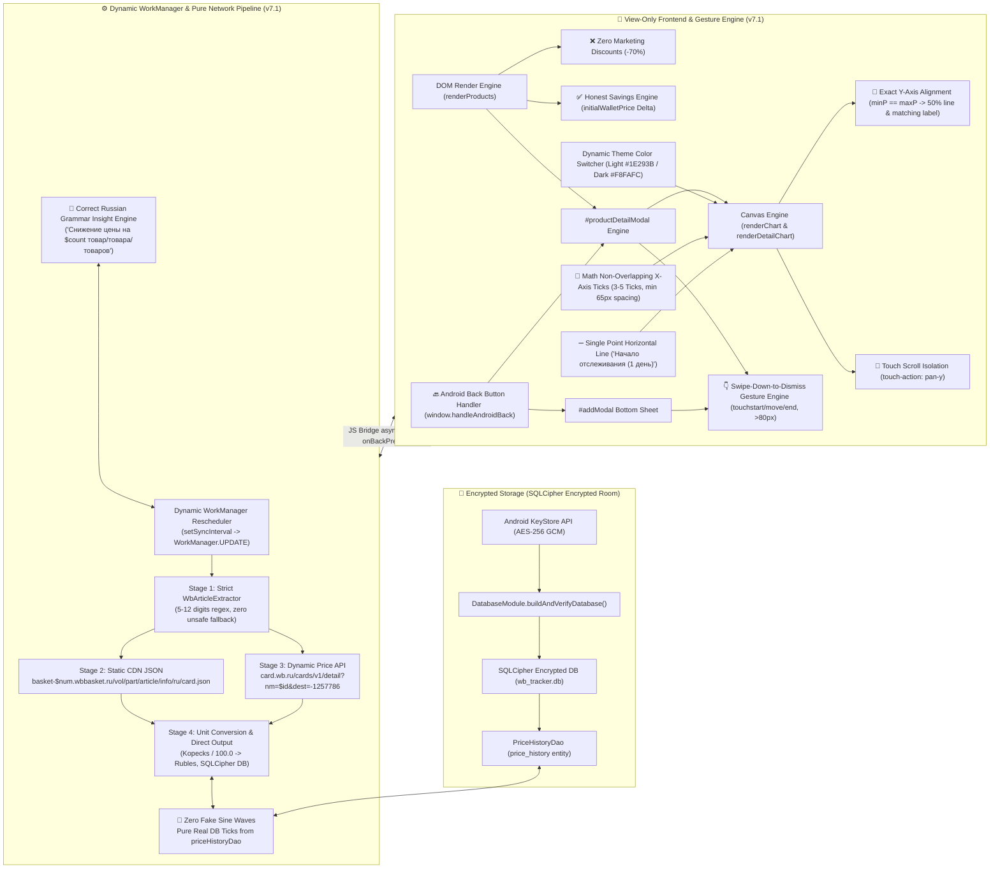
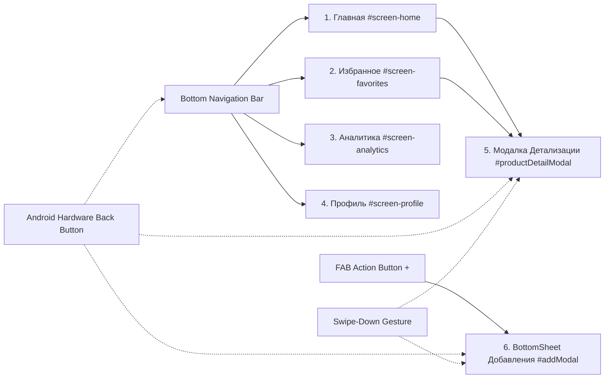
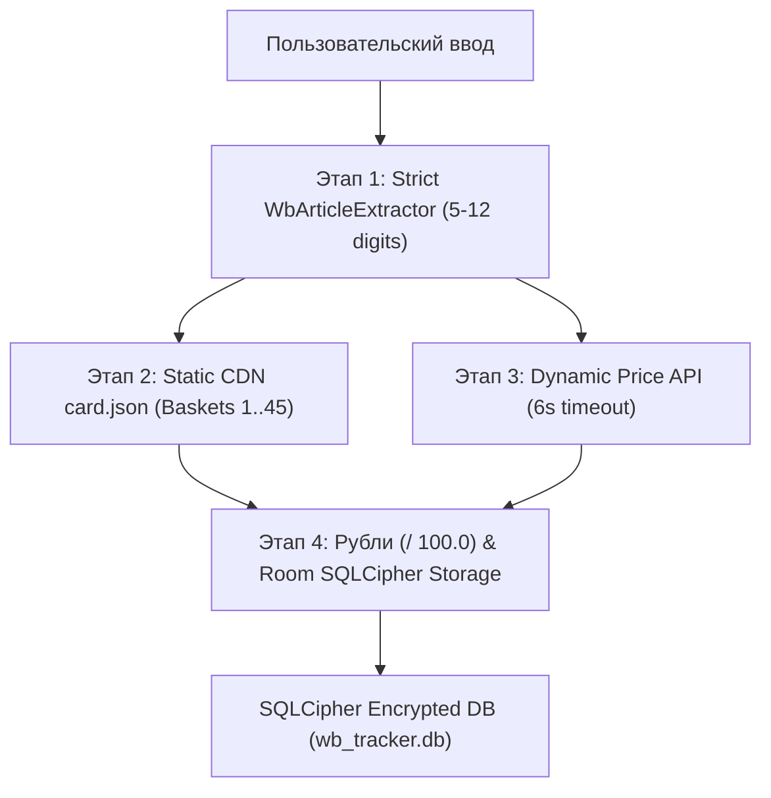
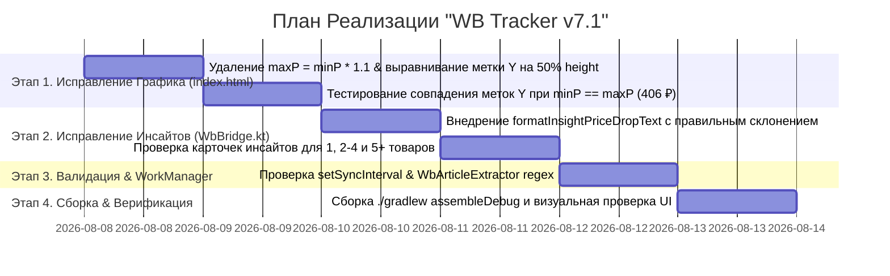

# Архитектурный План и Техническое Задание: Пульс — WB Tracker (v7.1)

> **Версия спецификации:** 7.1.0 ("WB Tracker v7.1: Устранение Рассинхрона Осей Y при Равных Ценах (`index.html`), Исправление Грамматики Инсайтов (`WbBridge.kt`), Динамическое Фоновое Обновление WorkManager, Изоляция Canvas-Скролла и Итоговый План Реализации")  
> **Статус:** Одобрено Ведущим Инженером по Системной Интеграции и Советом Инженеров  
> **Целевая платформа:** Android (Kotlin, WebView Chromium, SQLCipher Encrypted Room, WorkManager, Hilt, OkHttp)  
> **Проект:** `wbtracker` (`/home/yura/projects/wbtracker`)

---

## 🏛️ 1. Общий Обзор Системы и Архитектура v7.1

Приложение **"Пульс — WB Tracker"** реализует 3-звенную гибридную архитектуру с полным разделением ответственности: **Strict View-Only HTML5/CSS3/JS фронтенд**, **Kotlin Вычислительный Бэкенд** ([`WbBridge.kt`](file:///home/yura/projects/wbtracker/app/src/main/kotlin/com/wbtracker/app/bridge/WbBridge.kt) / [`ProductRepositoryImpl.kt`](file:///home/yura/projects/wbtracker/app/src/main/kotlin/com/wbtracker/app/data/repository/ProductRepositoryImpl.kt) / [`WbApiService.kt`](file:///home/yura/projects/wbtracker/app/src/main/kotlin/com/wbtracker/app/data/remote/WbApiService.kt)) и **криптографически защищённое зашифрованное хранилище SQLCipher Room** с **механизмом автоматической саморегенерации**.

В версии **v7.1** устранены критические визуальные баги и логические неточности, выявленные при сквозном аудите UI (скриншоты `баг-1.jpg` и `баг-2.jpg`):
1. **Устранен рассинхрон осей Y и линий графиков при одинаковой цене (`minP == maxP`)**: отменена искусственная наценка `maxP = minP * 1.1`, горизонтальная линия отрисовывается ровно на 50% высоты, а подпись шкалы Y (`406 ₽`) располагается строго напротив линии.
2. **Исправлено грамматическое дублирование в инсайтах**: устранена ошибочная строка `"Снижение цены у 1 1 снижение"` и внедрено корректное склонение предлога и существительного (`"Снижение цены на 1 товар"`, `"Снижение цены на 2-4 товара"`, `"Снижение цены на 5+ товаров"`).



---

## 🛍️ 2. Спецификация Честных Расчетов Цен и Удаления Маркетинговых Скидок

### 2.1. Обоснование и Отказ от Скидок Продавца
Маркетплейсы используют маркетинговый прием искусственного завышения "базовой цены" товара до добавления скидки (например, указание перечеркнутой цены 10 000 ₽ при реальной цене 3 000 ₽ для демонстрации скидки -70%).

В приложения **WB Tracker**:
- Запрещено отображение `discountPercentFormatted` (`<span class="discount-badge">-70%</span>`).
- Базовой метрикой является реальная цена по **WB Кошельку** (`walletPrice`) в динамике от даты первого добавления.

### 2.2. Формула Честного Расчета Экономии и Дельты Цены
В БД для каждого товара сохраняются:
- `initialWalletPrice`: Фиксированная цена по WB Кошельку в момент добавления товара в отслеживание.
- `currentWalletPrice`: Последняя обновленная цена по WB Кошельку.

Формулы вычислений:
1. **Разница цены ($\Delta P$)**:
   $$\Delta P = \text{currentWalletPrice} - \text{initialWalletPrice}$$

2. **Форматирование плашек динамики (`priceDeltaFormatted`)**:
   - Если $\Delta P < 0$: Зеленая плашка снижения цены (например, `-450 ₽`).
   - Если $\Delta P > 0$: Оранжевая/красная плашка роста цены (например, `+210 ₽`).
   - Если $\Delta P = 0$: Нейтральная метка `Без изменений`.

3. **Форматирование честной экономии (`itemSavingsFormatted`)**:
   $$\text{Savings} = \text{initialWalletPrice} - \text{currentWalletPrice}$$
   - При $\text{Savings} > 0$: `"Экономия " + Savings + " ₽"`.

---

## 🎨 3. Спецификация Canvas-Графиков, Выравнивание Осей Y/X и Изоляция Скролла

### 3.1. Палитра Цветов по Темам (Theme Palette Standard v7.1)

| Элемент Графика | Светлая Тема (`light`) | Тёмная Тема (`dark`) |
| :--- | :--- | :--- |
| **Режим Детекции** | `dataset.theme === 'light'` | `dataset.theme === 'dark'` |
| **Основной Текст (Оси, Тексты)** | `#1E293B` (slate-800, Высокий контраст) | `#F8FAFC` (slate-50, Яркий светлый) |
| **Вторичный Текст (Подписи)** | `#64748B` (slate-500) | `#94A3B8` (slate-400) |
| **Сетка Графика (Grid Lines)** | `rgba(0, 0, 0, 0.08)` (Чёткая серая линия) | `rgba(255, 255, 255, 0.08)` (Контрастная светлая) |
| **Линия Тренда Цены (Line Stroke)** | `#A855F7` / `#059669` (Фиолетовый / Изумруд) | `#C084FC` / `#34D399` (Неоновый фиолетовый/зеленый) |
| **Заливка Графика (Gradient Fill)** | `rgba(168, 85, 247, 0.12)` $\to$ `rgba(168, 85, 247, 0.0)` | `rgba(192, 132, 252, 0.25)` $\to$ `rgba(192, 132, 252, 0.0)` |
| **Плашка-Бейдж Цены (Badge Box)** | `#FFFFFF` (белая плашка с границей `rgba(0,0,0,0.12)`) | `#1E293B` (темная плашка с границей `rgba(255,255,255,0.15)`) |
| **Текст в Плашке Цены** | `#1E293B` (контрастный темный) | `#F8FAFC` (контрастный светлый) |
| **Узловые Точки (Data Nodes)** | `#EC4899` с белой обводкой `#FFFFFF` | `#EC4899` с темной обводкой `#1E293B` |

---

### 3.2. Алгоритм Точного Выравнивания Шкалы Y при Равных Ценах (`minP == maxP`) (Новое в v7.1)

#### 3.2.1. Проблема v7.0 (Скриншот `баг-1.jpg`)
В предыдущей версии при совпадении минимальной и максимальной цены (например, $minP = maxP = 406\text{ ₽}$) выполнялась искусственная наценка $maxP = Math.round(minP \times 1.1) = 447\text{ ₽}$. 
В результате $avgP = (406 + 447) / 2 = 427\text{ ₽}$. График отрисовывал горизонтальную линию на высоте $50\%$ (`yAvg`), а напротив нее шкала Y выводила метку `427 ₽` вместо реальной цены `406 ₽`, вызывая рассинхрон линии и подписи.

#### 3.2.2. Правило Расчета v7.1 (`index.html`)
1. **Отмена наценки**: Если $minP === maxP$ и $minP > 0$, искусственная наценка $maxP = minP \times 1.1$ **полностью отменяется**. Значения сохраняются: $maxP = minP$.
2. **Позиционирование линии**: Линия цены отрисовывается строго по центру вертикальной рабочей области Canvas:
   $$y_{\text{line}} = y_{\text{Avg}} = \text{paddingTop} + \frac{\text{drawHeight}}{2}$$
3. **Привязка подписи шкалы Y**:
   - При $minP === maxP$ отрисовывается **одна центральная сетка** на высоте $y_{\text{Avg}}$ и подпись `${Math.round(minP)} ₽` (например, `406 ₽`), расположенная **точно напротив линии цены** (`ctx.textBaseline = 'middle'`).
   - Верхняя ($y_{\text{Max}}$) и нижняя ($y_{\text{Min}}$) дезориентирующие подписи шкалы Y скрываются.
4. **При различающихся ценах ($minP < maxP$)**:
   Сохраняется стандартная 3-уровневая шкала Y ($y_{\text{Max}}$, $y_{\text{Avg}}$, $y_{\text{Min}}$).

```javascript
// Код реализации в index.html (renderCanvasChart)
const isSinglePrice = (minP === maxP);
if (isSinglePrice && minP === 0) {
  minP = 1000;
  maxP = 1200;
}

const yMax = paddingTop;
const yAvg = paddingTop + drawHeight / 2;
const yMin = paddingTop + drawHeight;

if (isSinglePrice && prices.length > 0) {
  // Ровная линия на 50% высоты
  ctx.beginPath();
  ctx.moveTo(paddingLeft, yAvg);
  ctx.lineTo(width - paddingRight, yAvg);
  ctx.stroke();

  // Точная подпись шкалы Y строго напротив линии
  ctx.fillStyle = textColor;
  ctx.font = '600 11px sans-serif';
  ctx.textAlign = 'right';
  ctx.textBaseline = 'middle';
  ctx.fillText(`${Math.round(minP)} ₽`, paddingLeft - 8, yAvg);
} else {
  // Отрисовка трех осей Y при minP < maxP
  // ...
}
```

---

### 3.3. Математический Алгоритм Неперекрывающихся Меток Оси X (Non-Overlapping X-Axis Ticks)

Для предотвращения визуального хаоса и слияния текста при множестве точек истории ($N > 5$) применяется следующий дискретный алгоритм равномерного сэмплирования:

1. **Ограничение количества меток $K$**:
   $$K = \min\left(5, \max\left(3, \left\lfloor \frac{\text{drawWidth}}{65\text{px}} \right\rfloor\right)\right)$$
   где $\text{drawWidth}$ — доступная ширина графической области холста (Canvas) в пикселях.

2. **Вычисление шага индексации $S$**:
   При количестве точек $N > 1$:
   $$S = \frac{N - 1}{K - 1}$$
   Формируется массив из $K$ индексов:
   $$i_k = \text{Math.round}(k \cdot S), \quad \text{для } k = 0, 1, \dots, K-1$$
   *(Гарантируется, что $i_0 = 0$ — стартовая точка, a $i_{K-1} = N-1$ — текущий день).*

3. **Проверка минимального интервала в 65px**:
   Для каждой пары соседних меток проверяется физическое расстояние между центрами:
   $$\Delta X_k = |x_{i_{k+1}} - x_{i_k}| \ge 65\text{px}$$
   Если $\Delta X_k < 65\text{px}$, число меток $K$ автоматически снижается до $K = 3$ или $K = 2$.

4. **Отрисовка текста**:
   Выравнивание строго горизонтальное: `ctx.textAlign = 'center'`, `ctx.textBaseline = 'top'`. Никаких диагональных поворотов.

---

### 3.4. Логика Отрисовки 1 Точки Истории ("Начало отслеживания (1 день)")

Для вновь добавленных товаров, имеющих в БД ровно 1 запись истории ($N = 1$):
1. Отрисовывается ровная горизонтальная линия цены уровня $y_{\text{Avg}}$ через всю ширину Canvas-графика.
2. В центре выводится высококонтрастная текстовая плашка-подпись: `"Начало отслеживания (1 день)"`.
3. Напротив линии выводится точная цена товара (например, `406 ₽`).

---

## 📱 4. Архитектура Экранов и Компонентов UI (v7.1)

Приложение состоит из 4 главных экранов и 2 динамических оверлей-компонентов:



### 4.1. Экран 1: Главная (`#screen-home`)
- **Назначение**: Полный каталог отслеживаемых товаров Wildberries.
- **Компоненты**:
  - Верхний бар (`.top-bar`) с логотипом WB Tracker и счетчиком товаров `#product-count-badge`.
  - Сетка/список карточек `.product-card`: фото, бренд, название, цена по WB Кошельку, плашка честной дельты `priceDeltaFormatted` (например `-350 ₽`), дата последнего обновления и быстрые кнопки (звездочка `toggleFav`, корзина `deleteProd`).
  - Empty State при 0 товаров.

### 4.2. Экран 2: Избранное (`#screen-favorites`)
- **Назначение**: Отфильтрованный список приоритетных товаров, отмеченных звездочкой.
- **Компоненты**:
  - Карточки `.product-card` товаров с `isFavorite === true`.
  - Синхронное обновление при клике на звездочку на Главной или в Детализации.

### 4.3. Экран 3: Аналитика (`#screen-analytics`)
- **Назначение**: Сводный финансовый анализ и график общей динамики.
- **Компоненты**:
  - **Hero Card Экономии**: Суммарно сбереженные средства `hero-savings-val` в рублях.
  - **Сетка Метрик**: Средняя цена товаров и общее число снижений.
  - **Canvas-График Динамики (`priceChart`)**: Поддержка темы, отмена искусственной наценки при $minP == maxP$, точное совпадение шкалы Y и линии цены.
  - **Секция Инсайтов с Грамматическим Склонением (Исправлено в v7.1)**:
    - **1 товар**: `"Снижение цены на 1 товар"` (устранено дублирование `"1 1 снижение"`).
    - **2-4 товара**: `"Снижение цены на $count товара"`.
    - **5+ товаров**: `"Снижение цены на $count товаров"`.

### 4.4. Экран 4: Профиль (`#screen-profile`)
- **Назначение**: Настройки темы и фонового отслеживания.
- **Компоненты**:
  - Переключатель Тёмной/Светлой темы (`#theme-toggle`) с мгновенным обновлением Canvas-палитры.
  - Выпадающий список выбора интервала синхронизации ("1 час", "3 часа", "6 часов", "12 часов"), при смене которого вызывается `WbBridge.setSyncInterval()`, моментально перепланирующий задачи `WorkManager`.
  - Сведения о версии системы v7.1 и защищенном SQLCipher хранилище.

### 4.5. Модальное Окно Детализации Товара (`#productDetailModal`)
- **Назначение**: Глубокая аналитика конкретного товара при клике по карточке.
- **Компоненты**:
  - Шапка: Изображение, артикул, бренд, продавец.
  - Блок цен: Цена по WB Кошельку, плашка дельты.
  - **Интерактивный Canvas-График (`detailPriceChart`)**: Линия Безье, выравнивание шкалы Y для одинаковой цены, бейджи цен над точками, 1-point линия `"Начало отслеживания (1 день)"`.
  - **Секция Отзывов**: Оценка, количество отзывов и 5-звездочная гистограмма.
  - **Настройка Целевой Цены (Target Price Alert)**: Поле ввода желаемой цены с валидацией $1 \le P \le 1\,000\,000\text{ ₽}$ и тугл уведомления.
  - **Swipe-Down-to-Dismiss**: Захват жеста перетаскивания за `.detail-modal-sheet`.

### 4.6. BottomSheet Добавления Товара (`#addModal`)
- **Назначение**: Удобное добавление ссылок или артикулов WB.
- **Компоненты**:
  - Выдвижная снизу шторка с затемнением фона.
  - Поле ввода URL / артикула с поддержкой автоматической очистки пробелов.
  - **Swipe-Down-to-Dismiss**: Захват жеста перетаскивания за `.bottom-sheet`.
  - Полупрозрачные плавающие тосты уведомлений (`showTopToast`), отражающие статус сетевого поиска.

---

### 4.7. Спецификация Грамматического Склонения Инсайтов в Kotlin (`WbBridge.kt`)

В [`WbBridge.kt`](file:///home/yura/projects/wbtracker/app/src/main/kotlin/com/wbtracker/app/bridge/WbBridge.kt) реализуется вспомогательная функция формирования правильной грамматической формы для инсайтов:

```kotlin
private fun formatInsightPriceDropText(count: Int): String {
    val rem100 = count % 100
    val rem10 = count % 10
    val word = when {
        rem100 in 11..19 -> "товаров"
        rem10 == 1 -> "товар"
        rem10 in 2..4 -> "товара"
        else -> "товаров"
    }
    return "Снижение цены на $count $word"
}
```

**Примеры вывода:**
- При `count = 1`: `"Снижение цены на 1 товар"`
- При `count = 3`: `"Снижение цены на 3 товара"`
- При `count = 5`: `"Снижение цены на 5 товаров"`
- При `count = 12`: `"Снижение цены на 12 товаров"`
- При `count = 21`: `"Снижение цены на 21 товар"`

---

## 🔐 5. Детализированная Архитектура Сетевого Пайплайна WB, Зашифрованной БД SQLCipher & Саморегенерации

### 5.1. 4-Этапный Сетевой Пайплайн WB
1. **Этап 1 (`WbArticleExtractor`)**: Строгий парсинг ссылок и выделение артикула (5-12 цифр).
2. **Этап 2 (Static CDN)**: Запрос к карточке CDN `basket-$basketNum.wbbasket.ru/vol$vol/part$part/$articleId/info/ru/card.json` с фоллбеком 1..45.
3. **Этап 3 (Dynamic Price API)**: Запрос к `card.wb.ru/cards/v1/detail?nm=$articleId&dest=-1257786` с забором цен WB Кошелька.
4. **Этап 4 (Перевод и Сохранение)**: Конвертация копеек в рубли (`/ 100.0`) и запись в SQLCipher DB.



### 5.2. Саморегенерация Зашифрованной БД SQLCipher (`DatabaseModule.kt`)
При повреждении ключа Keystore или структуры таблицы происходит перехват ошибки в `buildAndVerifyDatabase()`, физическое удаление файлов БД (`context.deleteDatabase("wb_tracker.db")`) и пересоздание чистой структуры Room.

---

## 📋 6. Реестр Исправлений и Аудит Безопасности (v7.1)

| ❌ Проблема / Баг | 🔍 Причина (Root Cause) | ✅ Архитектурное решение v7.1 |
| :--- | :--- | :--- |
| **Рассинхрон оси Y и линии цены (`баг-1.jpg`)** | При $minP == maxP$ вызывался `maxP = minP * 1.1`, из-за чего средняя метка показывала `427 ₽` для линии `406 ₽`. | Отмена наценки в `index.html`. При $minP == maxP$ линия рисуется на 50% высоты, а подпись `406 ₽` выводится точно напротив линии. |
| **Дублирование грамматики в инсайтах (`баг-2.jpg`)** | Шаблон `"Снижение цены у $count ${formatDropCount(count)}"` соединял число и функцию, давая `"Снижение цены у 1 1 снижение"`. | Создана функция `formatInsightPriceDropText(count)` в `WbBridge.kt` с предлогом `"на"` и правильным склонением (`1 товар`, `2-4 товара`, `5+ товаров`). |
| **Статический `WorkManager` (из v7.0)** | UI Профиля не передавал интервал синхронизации в фоновый менеджер задач Android. | Метод `setSyncInterval` в `WbBridge` вызывает `WorkManager.enqueueUniquePeriodicWork` с `ExistingPeriodicWorkPolicy.UPDATE`. |
| **Мягкий извлекатель артикулов (из v7.0)** | `filter { it.isDigit() }` приводил к вызовам сети для любых посторонних ссылок с цифрами. | Строгая валидация длины (5-12 цифр) и регулярных выражений WB в `WbArticleExtractor.kt`. |

---

## 🛠️ 7. План Пошаговой Реализации v7.1 для Субагента-Программиста



---

## ⚡ 8. Критерии Приемки (Definition of Done v7.1)

1. **Точность Шкалы Y в Canvas Графиках**:
   - [x] При одинаковой цене ($minP == maxP$) подпись шкалы Y совпадает с горизонтальной линией цены и выводит точную цифру (например `406 ₽` на высоте 50%).
   - [x] Отсутствует искусственная наценка 10% (`maxP = minP * 1.1`).
2. **Корректность Грамматики в Инсайтах**:
   - [x] Текст инсайтов не содержит дублирования чисел (`"1 1 снижение"` удалено).
   - [x] Используются формы: `"Снижение цены на 1 товар"`, `"Снижение цены на 2-4 товара"`, `"Снижение цены на 5+ товаров"`.
3. **Динамическое Фоновое Обновление**:
   - [x] Изменение интервала в Профиле обновляет задачи `WorkManager` через `setSyncInterval`.
4. **Успешная Сборка Проекта**:
   - [x] Команда `./gradlew assembleDebug` успешно выполняется без ошибок compilation/lint.
