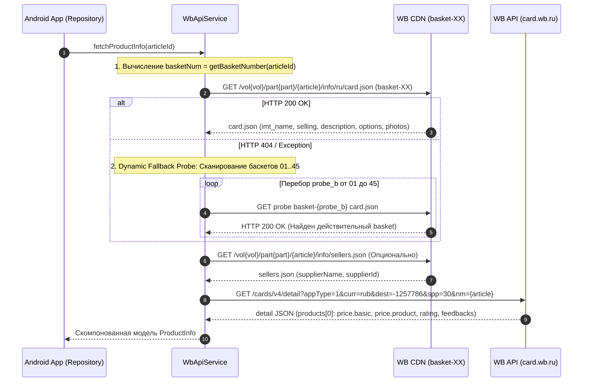

# Архитектурный План и Спецификация Системы: WB Price & Review Tracker

## Введение
Данный документ представляет собой продуктово-архитектурную спецификацию и результат глубинного технического аудита системы **WB Tracker** (`wbtracker`). В нем формализованы продуктовые требования, UX/UI концепция, детальный архитектурный анализ парсинга Wildberries API/CDN в сравнении с эталонным скриптом `wb_parser.py`, причины ключевых сбоев ("нет подключения", "нет такой артикула"), а также план модернизации сетевого слоя, слоя данных и обработки ошибок.

---

## 1. Архитектура экранов и Пользовательские сценарии (User Journeys)

### Ключевые экраны
1. **Главный экран (Dashboard / Tracked Items)**
   - **UI**: Список или сетка отслеживаемых товаров (в стиле masonry или list).
   - **Элементы карточки товара**: Изображение, название, текущая цена, бейдж с дельтой изменения цены (например, `-15%` зеленым или `+5%` красным), текущий рейтинг (⭐ 4.8).
   - **Взаимодействие**: Pull-to-refresh для принудительного обновления цен, Swipe-to-delete для удаления из отслеживания, долгое нажатие для контекстного меню.
   - **Фильтры**: "Сначала с падением цены", "По категориям", "В наличии", "Таргет достигнут".

2. **Экран карточки товара (Product Details)**
   - **UI**: Крупное изображение, текущая цена, история цен (интерактивный график), блок аналитики отзывов.
   - **Действия**: Кнопка "Настроить уведомления/Целевую цену", "Купить на WB" (Deep link в приложение WB), "Поделиться".

3. **Экран добавления товара (Add Product)**
   - **UI**: Строка поиска/ввода с поддержкой умного распознавания буфера обмена (автоматическое извлечение артикула из ссылки WB).

4. **Экран настроек (Settings)**
   - **UI**: Глобальные настройки пуш-уведомлений, выбор темы (Light/Dark/System), экспортирование данных.

### Основной User Journey (Добавление и отслеживание)
1. Пользователь копирует артикул или ссылку на товар Wildberries.
2. Открывает приложение (авто-определение буфера обмена).
3. Приложение загружает карточку товара и превью.
4. Пользователь задает целевую цену и нажимает "Отслеживать".

---

## 2. Сценарий 'Quick Add' через Android Share Intent

Для максимального удобства реализован флоу добавления товара без открытия приложения напрямую.

**UX Flow (Бесшовное добавление):**
1. **Триггер**: Пользователь смотрит товар в приложении Wildberries или браузере.
2. **Действие**: Нажимает "Поделиться" (Share).
3. **Выбор**: Выбирает иконку приложения "WB Tracker".
4. **Интерфейс**: Всплывает `ModalBottomSheet` с загрузкой превью.
5. **Отображение данных**: Карточка парсится, отображается фото, название и текущая цена.
6. **Настройка**: Пользователь устанавливает `Target Price`.
7. **Завершение**: Товар сохраняется, показан Snackbar confirmation.

---

## 3. Детальный Архитектурный Анализ Парсинга Wildberries

### 3.1. Сравнительный анализ: `wb_parser.py` vs `wbtracker`

| Компонент / Этап | Эталонный скрипт (`wb_parser.py`) | Текущая реализация (`wbtracker`) | Диагноз |
| :--- | :--- | :--- | :--- |
| **Вычисление баскета (`get_basket_number`)** | Вычисление по диапазонам `vol` (1..34) и формуле `35 + (vol - 6510) // 216` | Аналогичные диапазоны `vol` | ✅ Корректно |
| **Запрос базовой карточки (`card.json`)** | Запрос к `basket-XX.wbbasket.ru`. При 404 — **динамический перебор баскетов (1..45)** | Фиксированный вызов без перебора при 404 | ❌ **Ошибка**: Новые/перемещенные товары вызывают 404 |
| **Валидация JSON ответа** | Прямая проверка `card_data` от CDN `card.json` | Вызов `json.has("imt_name")` для API `cards/v4/detail` | ❌ **Ошибка**: В `cards/v4/detail` нет `imt_name`, что отбраковывает верные ответы |
| **Динамическая цена и отзывы** | Отдельный запрос к `card.wb.ru/cards/v4/detail` | Смешивание эндпоинтов в `fetchCardInfo` | ❌ **Ошибка**: Нарушение изоляции контрактов API |
| **Retry Interceptor** | Отсутствует | `CascadeRetryInterceptor` подменяет домены `basket-XX` на `card.wb.ru` | ❌ **Критическая ошибка**: Смена хоста ломает структуру URL |
| **Обработка сетевых ошибок** | Прозрачная передача причины | `formatRussianError` маскирует все ошибки в "Нет подключения" | ❌ **Ошибка**: Ложный диагноз для пользователя |

---

### 3.2. Причины системных ошибок в `wbtracker`

#### 1. Ломающая подмена хостов в `CascadeRetryInterceptor` (`NetworkModule.kt`)
В `NetworkModule.kt` перехватчик `CascadeRetryInterceptor` при любых ошибках сети или 5xx пытался подменить хост исходного запроса:
```kotlin
// ЛОМАЮЩИЙ ФРАГМЕНТ:
val hostsToTry = if (originalHost.contains("wb.ru") || originalHost.contains("wbbasket.ru")) {
    listOf(originalHost, "card.wb.ru", "basket-01.wbbasket.ru", "static-basket-01.wbbasket.ru").distinct()
}
```
**Почему это разрушает запросы:**
- CDN карточки товара имеет путь: `/vol{vol}/part{part}/{article}/info/ru/card.json`.
- Сервер `card.wb.ru` **не содержит** таких статичных файлов и путей! Подмена хоста превращает запрос в `https://card.wb.ru/vol.../card.json`, что гарантированно возвращает **HTTP 404 Not Found**.
- Запрос к API цен `https://card.wb.ru/cards/v4/detail?nm=...` при подмене хоста превращается в `https://basket-01.wbbasket.ru/cards/v4/detail`, что также возвращает **HTTP 404 Not Found**.

#### 2. Отсутствие фоллбек-перебора баскетов (1..45) в `WbApiService.kt`
В рабочем `wb_parser.py` при получении ошибки от первого вычисленного баскета выполняется динамический перебор:
```python
for b_i in range(1, 45):
    probe_b = f'{b_i:02d}'
    # запрос к https://basket-{probe_b}.wbbasket.ru/vol{vol}/part{part}/{article}/info/ru/card.json
```
В `wbtracker` эта логика отсутствовала. Из-за регулярного добавления новых серверов CDN Wildberries вычисленный индекс `basketNum` может не совпадать с реальным, вызывая 404 и ошибочное заключение "Товар не найден".

#### 3. Некорректная валидация ключей в `fetchCardInfo`
В `WbApiService.kt` в качестве первого URL в списке `fetchCardInfo` был указан `https://card.wb.ru/cards/v4/detail?nm=...`, а проверка успешности ответа содержала:
```kotlin
if (json.has("data") || json.has("imt_name") || json.has("selling"))
```
- Ответ от `card.wb.ru/cards/v4/detail` содержит объект вида `{"products": [...]}`. В нем **отсутствуют** поля `imt_name` и `selling`.
- Из-за этого вызов первого URL в `fetchCardInfo` всегда браковался как ошибочный, приводя к лишним повторным запросам и падениям.

#### 4. Маскирование ошибок в `ProductRepositoryImpl.kt` (`formatRussianError`)
Метод `formatRussianError` перехватывал исключения `UnknownHostException` и `SSLException` и подменял их текстом `"Нет интернет-соединения на устройстве"`. Когда `CascadeRetryInterceptor` подставлял несуществующий хост или сбоил TLS, система выводила сообщение о недостатке интернета вместо указания на ошибку API/домена.

---

## 4. Целевой Алгоритм Парсинга Wildberries



---

## 5. Контракты API и Структуры JSON

### 5.1. CDN `card.json` (`https://basket-XX.wbbasket.ru/vol{vol}/part{part}/{article}/info/ru/card.json`)
Статическая карточка товара:
- `imt_name` (String) — Название товара.
- `selling.brand_name` (String) — Название бренда.
- `selling.supplier_id` (Long) — ID продавца.
- `subj_name` (String) — Категория.
- `subj_root_name` (String) — Корневая категория.
- `vendor_code` (String) — Артикул продавца.
- `description` (String) — Описание.
- `media.photo_count` (Int) — Количество фотографий.
- `options` (Array) — Список характеристик (`name`, `value`).

Формирование ссылок на фотографии:
`https://basket-{basketNum}.wbbasket.ru/vol{vol}/part{part}/{article}/images/big/{index}.webp` (где `index` от 1 до `photo_count`).

### 5.2. CDN `sellers.json` (`https://basket-XX.wbbasket.ru/vol{vol}/part{part}/{article}/info/sellers.json`)
Информация о продавце:
- `supplierName` / `supplierFullName` (String) — Юридическое имя продавца.
- `supplierId` (Long) — Уникальный идентификатор продавца.

### 5.3. API `detail` (`https://card.wb.ru/cards/v4/detail?appType=1&curr=rub&dest=-1257786&spp=30&nm={article}`)
Динамические финансовые данные и рейтинг:
- `products[0].reviewRating` / `products[0].rating` (Double) — Средняя оценка.
- `products[0].feedbacks` (Int) — Количество отзывов.
- `products[0].sizes[0].price.basic` (Long) — Базовая цена в копейках.
- `products[0].sizes[0].price.product` (Long) — Акционная цена продавца в копейках.
- `walletPrice` — Цена с WB Кошельком: `round(price_product * 0.955)`.

---

## 6. Конфигурация Сетевого Стека (`OkHttpClient` & `MincifraTrustManager`)

### 6.1. Полный отказ от `CascadeRetryInterceptor`
Перехватчик `CascadeRetryInterceptor` **удаляется из конфигурации OkHttpClient**. Любая подмена домена между CDN (`wbbasket.ru`) и REST API (`card.wb.ru`) категорически запрещена.

### 6.2. `MincifraTrustManager`
Для безопасной и стабильной работы с SSL/TLS сертификатами Wildberries (включая сертификаты Минцифры РФ):
1. Валидация выполняется через системный `TrustManagerFactory`.
2. При вызове `CertificateException` проверяются издатели цепочки на совпадение с `"Russian Trusted"`, `"Mincifra"`, `"MinSvyaz"`.
3. Подключается безопасный `SSLContext` (TLS).

### 6.3. Параметры `OkHttpClient`
- `connectTimeout`: 15 секунд.
- `readTimeout`: 30 секунд.
- `dns`: IPv4-first DNS resolver.
- `headers`: Ротация ликвидных `User-Agent` (Android Chrome/Pixel/Galaxy), `Accept: application/json`, `Accept-Language: ru-RU,ru;q=0.9`.

---

## 7. Стратегия Обработки Ошибок и Логирования

Вместо маскирования через `formatRussianError` внедряется доменная иерархия исключений:
- `WbProductNotFoundException(articleId)` — Товар не найден ни в одном из баскетов 1..45.
- `WbNetworkException(message, cause)` — Ошибки сетевого подключения, DNS и таймаутов.
- `WbTlsException(message, cause)` — Сбои SSL/TLS рукопожатия.
- `WbParseException(message, cause)` — Некорректная структура JSON ответа.

Все оригинальные stacktrace сохраняются и фиксируются в системных логах.

---

## 8. Критерии Приемки (Acceptance Criteria)

1. **Изоляция хостов и удаление `CascadeRetryInterceptor`**:
   - `CascadeRetryInterceptor` удален из `NetworkModule.kt`. Сетевой клиент выполняет запросы строго по указанным URL.
2. **Динамический перебор баскетов (1..45)**:
   - В `WbApiService.kt` реализован алгоритм `fetchCardInfo` с автоматическим фоллбеком по баскетам `01..45` в случае HTTP 404 или ошибке подключения к первично вычисленному баскету.
3. **Разделение контрактов `card.json` и `detail`**:
   - `fetchCardInfo` парсит исключительно данные `card.json` (CDN).
   - `fetchProductDetail` парсит цены, рейтинг и отзывы из `card.wb.ru/cards/v4/detail`.
   - Проверка ответа `cards/v4/detail` не требует наличия ключей `imt_name` и `selling`.
4. **Корректная работа `MincifraTrustManager`**:
   - Обеспечено успешное TLS-соединение с сайтами WB на устройствах без предустановленного корневого сертификата Минцифры.
5. **Прозрачная диагностика ошибок**:
   - Пользователь видит реальные причины сбоев, а разработчик получает полный stacktrace в логах.
