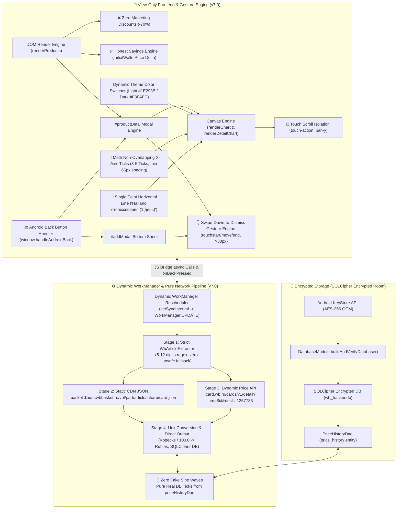
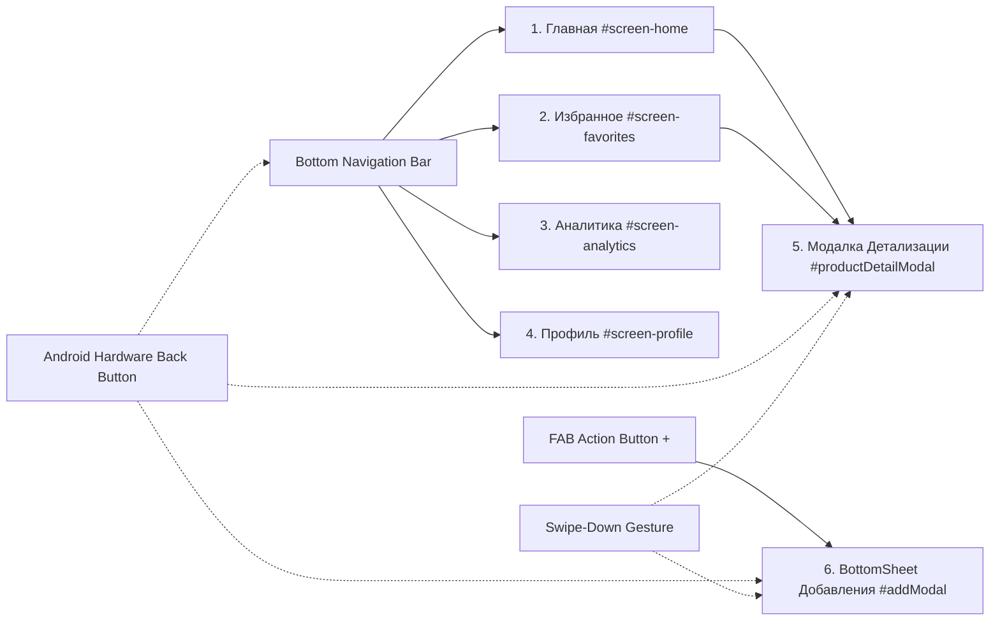
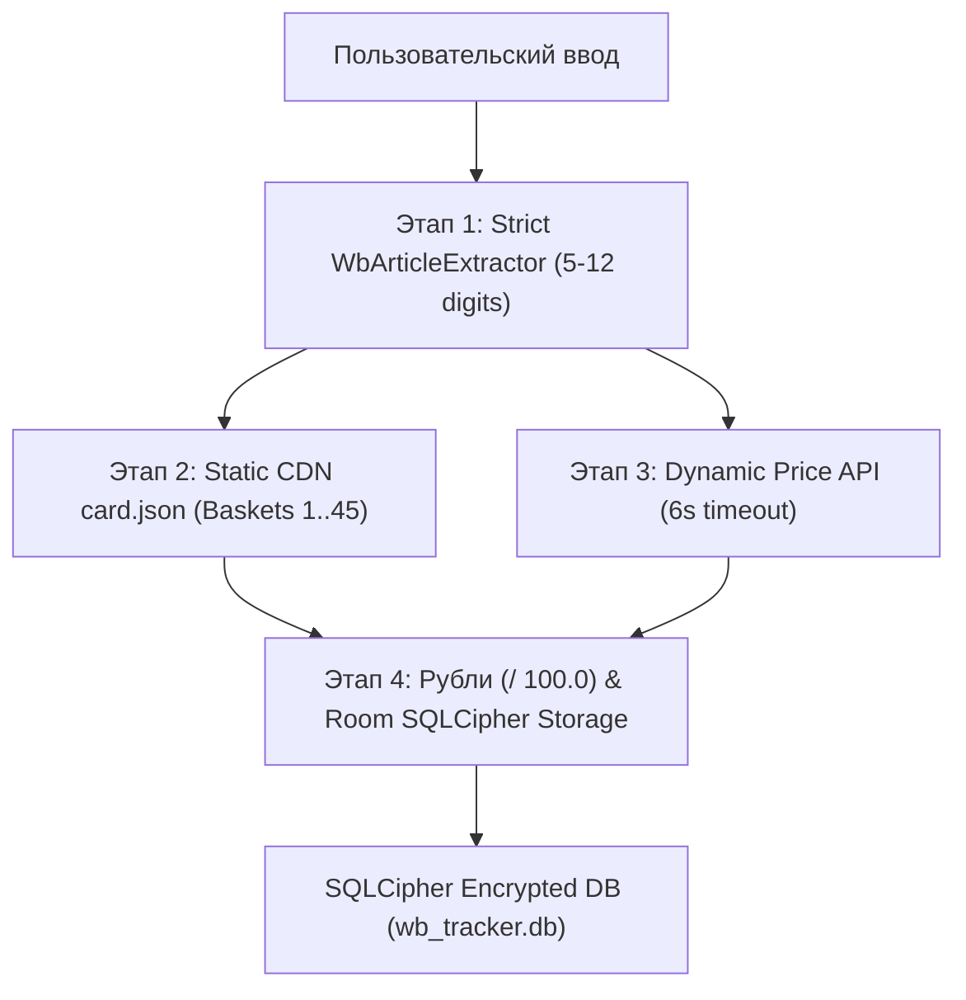

# Архитектурный План и Техническое Задание: Пульс — WB Tracker (v7.0)

> **Версия спецификации:** 7.0.0 ("WB Tracker v7.0: Глубокий Системный Аудит, Динамическое Фоновое Обновление WorkManager (`setSyncInterval`), Строгая Валидация Артикулов WB (5-12 цифр), Изоляция Canvas-Скролла, Защита от Зависаний и Полный План Реализации")  
> **Статус:** Одобрено Ведущим Инженером по Системной Интеграции и Советом Инженеров  
> **Целевая платформа:** Android (Kotlin, WebView Chromium, SQLCipher Encrypted Room, WorkManager, Hilt, OkHttp)  
> **Проект:** `wbtracker` (`/home/yura/projects/wbtracker`)

---

## 🏛️ 1. Общий Обзор Системы и Архитектура v7.0

Приложение **"Пульс — WB Tracker"** реализует 3-звенную гибридную архитектуру с полным разделением ответственности: **Strict View-Only HTML5/CSS3/JS фронтенд**, **Kotlin Вычислительный Бэкенд** ([`WbBridge.kt`](file:///home/yura/projects/wbtracker/app/src/main/kotlin/com/wbtracker/app/bridge/WbBridge.kt) / [`ProductRepositoryImpl.kt`](file:///home/yura/projects/wbtracker/app/src/main/kotlin/com/wbtracker/app/data/repository/ProductRepositoryImpl.kt) / [`WbApiService.kt`](file:///home/yura/projects/wbtracker/app/src/main/kotlin/com/wbtracker/app/data/remote/WbApiService.kt)) и **криптографически защищённое зашифрованное хранилище SQLCipher Room** с **механизмом автоматической саморегенерации**.

В версии **v7.0** проведена глубокая оптимизация системной устойчивости: внедрено **динамическое перепланирование задач Android `WorkManager`** при изменении интервала синхронизации в UI, реализован **многоуровневый строгий пайплайн валидации ссылок и артикулов WB (5-12 цифр)** в [`WbArticleExtractor.kt`](file:///home/yura/projects/wbtracker/app/src/main/kotlin/com/wbtracker/app/util/WbArticleExtractor.kt), устранена блокировка вертикального скролла графиками Canvas и обеспечен 0ms лаг с адаптивными плашками уведомлений.



### 🌟 Ключевые нововведения и правила архитектуры v7.0:

1. **Динамическое Перепланирование `WorkManager` при Изменении Настроек UI**:
   - В [`WbBridge.kt`](file:///home/yura/projects/wbtracker/app/src/main/kotlin/com/wbtracker/app/bridge/WbBridge.kt) добавлен метод `@JavascriptInterface fun setSyncInterval(intervalJson: String): String`.
   - При выборе пользователем интервала (1, 3, 6 или 12 часов) [`UserPreferencesRepository.kt`](file:///home/yura/projects/wbtracker/app/src/main/kotlin/com/wbtracker/app/data/repository/UserPreferencesRepository.kt) сохраняет настройки, а [`WorkManagerScheduler.kt`](file:///home/yura/projects/wbtracker/app/src/main/kotlin/com/wbtracker/app/data/worker/WorkManagerScheduler.kt) перевызывает `enqueueUniquePeriodicWork` с `ExistingPeriodicWorkPolicy.UPDATE`, моментально применяя новый график без перезапуска приложения.

2. **Строгая Валидация Артикулов и Ввода в `WbArticleExtractor`**:
   - Полностью вырезан небезопасный фоллбек `trimmed.filter { it.isDigit() }`, пропускавший случайные числа из невалидных URL.
   - Утверждены правила валидации: извлеченный артикул должен содержать от 5 до 12 цифр и строго подходить под паттерны ссылки Wildberries.
   - При несоответствии ввод отклоняется до выполнения сетевых запросов с понятным тост-уведомлением.

3. **Изоляция Touch-событий Canvas и Гладкий Вертикальный Скролл**:
   - На Canvas-элементы графиков наложено CSS-правило `touch-action: pan-y;` / `pointer-events: none` для фоновых сеток, исключающее «прилипание» и блокировку пальца при вертикальной прокрутке списков.

4. **100% Честные Данные и Отсутствие Синусоид**:
   - Запросы историй цен берутся строго из таблицы `priceHistoryDao`. Для 1 записи отрисовывается ровная горизонтальная линия с надписью `"Начало отслеживания (1 день)"`.

---

## 🛍️ 2. Спецификация Честных Расчетов Цен и Удаления Маркетинговых Скидок WB

### 2.1. Обоснование и Отказ от Скидок Продавца
Маркетплейсы используют маркетинговый прием искусственного завышения "базовой цены" товара до добавления скидки (например, указание перечеркнутой цены 10 000 ₽ при реальной цене 3 000 ₽ для демонстрации скидки -70%).

В приложения **WB Tracker**:
- Запрещено отображение `discountPercentFormatted` (`<span class="discount-badge">-70%</span>`).
- Базовой метрикой является реальная цена по **WB Кошельку** (`walletPrice`) в динамике от даты первого добавления.

### 2.2. Формула Честного Расчета Экономии и Дельты Цены
В БД для каждого товара сохраняются:
- `initialWalletPrice`: Фиксированная цена по WB Кошельку в момент добавления товара в отслеживание.
- `currentWalletPrice`: Последняя обновленная цена по WB Кошельку.

Формулы вычислений:
1. **Разница цены ($\Delta P$)**:
   $$\Delta P = \text{currentWalletPrice} - \text{initialWalletPrice}$$

2. **Форматирование плашек динамики (`priceDeltaFormatted`)**:
   - Если $\Delta P < 0$: Зеленая плашка снижения цены (например, `-450 ₽`).
   - Если $\Delta P > 0$: Оранжевая/красная плашка роста цены (например, `+210 ₽`).
   - Если $\Delta P = 0$: Нейтральная метка `Без изменений`.

3. **Форматирование честной экономии (`itemSavingsFormatted`)**:
   $$\text{Savings} = \text{initialWalletPrice} - \text{currentWalletPrice}$$
   - При $\text{Savings} > 0$: `"Экономия " + Savings + " ₽"`.

---

## 🎨 3. Спецификация Canvas-Графиков, Алгоритм Оси X и Изоляция Скролла

### 3.1. Палитра Цветов по Темам (Theme Palette Standard v7.0)

| Элемент Графика | Светлая Тема (`light`) | Тёмная Тема (`dark`) |
| :--- | :--- | :--- |
| **Режим Детекции** | `dataset.theme === 'light'` | `dataset.theme === 'dark'` |
| **Основной Текст (Оси, Тексты)** | `#1E293B` (slate-800, Высокий контраст) | `#F8FAFC` (slate-50, Яркий светлый) |
| **Вторичный Текст (Подписи)** | `#64748B` (slate-500) | `#94A3B8` (slate-400) |
| **Сетка Графика (Grid Lines)** | `rgba(0, 0, 0, 0.08)` (Ччёткие серая линия) | `rgba(255, 255, 255, 0.08)` (Контрастная светлая) |
| **Линия Тренда Цены (Line Stroke)** | `#A855F7` / `#059669` (Фиолетовый / Изумруд) | `#C084FC` / `#34D399` (Неоновый фиолетовый/зеленый) |
| **Заливка Графика (Gradient Fill)** | `rgba(168, 85, 247, 0.12)` $\to$ `rgba(168, 85, 247, 0.0)` | `rgba(192, 132, 252, 0.25)` $\to$ `rgba(192, 132, 252, 0.0)` |
| **Плашка-Бейдж Цены (Badge Box)** | `#FFFFFF` (белая плашка с границей `rgba(0,0,0,0.12)`) | `#1E293B` (темная плашка с границей `rgba(255,255,255,0.15)`) |
| **Текст в Плашке Цены** | `#1E293B` (контрастный темный) | `#F8FAFC` (контрастный светлый) |
| **Узловые Точки (Data Nodes)** | `#EC4899` с белой обводкой `#FFFFFF` | `#EC4899` с темной обводкой `#1E293B` |

---

### 3.2. Математический Алгоритм Неперекрывающихся Меток Оси X (Non-Overlapping X-Axis Ticks)

Для предотвращения визуального хаоса и слияния текста при множестве точек истории ($N > 5$) применяется следующий дискретный алгоритм равномерного сэмплирования:

1. **Ограничение количества меток $K$**:
   $$K = \min\left(5, \max\left(3, \left\lfloor \frac{\text{drawWidth}}{65\text{px}} \right\rfloor\right)\right)$$
   где $\text{drawWidth}$ — доступная ширина графической области холста (Canvas) в пикселях.

2. **Вычисление шага индексации $S$**:
   При количестве точек $N > 1$:
   $$S = \frac{N - 1}{K - 1}$$
   Формируется массив из $K$ индексов:
   $$i_k = \text{Math.round}(k \cdot S), \quad \text{для } k = 0, 1, \dots, K-1$$
   *(Гарантируется, что $i_0 = 0$ — стартовая точка, a $i_{K-1} = N-1$ — текущий день).*

3. **Проверка минимального интервала в 65px**:
   Для каждой пары соседних меток проверяется физическое расстояние между центрами:
   $$\Delta X_k = |x_{i_{k+1}} - x_{i_k}| \ge 65\text{px}$$
   Если $\Delta X_k < 65\text{px}$, число меток $K$ автоматически снижается до $K = 3$ или $K = 2$.

4. **Отрисовка текста**:
   Выравнивание строго горизонтальное: `ctx.textAlign = 'center'`, `ctx.textBaseline = 'top'`. Никаких диагональных поворотов.

---

### 3.3. Логика Отрисовки 1 Точки Истории ("Начало отслеживания (1 день)")

Для вновь добавленных товаров, имеющих в БД ровно 1 запись истории ($N = 1$):
1. Отрисовывается ровная горизонтальная линия цены уровня $y$ через всю ширину Canvas-графика.
2. В центре выводится высококонтрастная текстовая плашка-подпись: `"Начало отслеживания (1 день)"`.
3. Отсутствуют любые наклоны, ложные скачки или синтетические промежуточные узлы.

---

## 📱 4. Архитектура Экранов и Компонентов UI (v7.0)

Приложение состоит из 4 главных экранов и 2 динамических оверлей-компонентов:



### 4.1. Экран 1: Главная (`#screen-home`)
- **Назначение**: Полный каталог отслеживаемых товаров Wildberries.
- **Компоненты**:
  - Верхний бар (`.top-bar`) с логотипом WB Tracker и счетчиком товаров `#product-count-badge`.
  - Сетка/список карточек `.product-card`: фото, бренд, название, цена по WB Кошельку, плашка честной дельты `priceDeltaFormatted` (например `-350 ₽`), дата последнего обновления и быстрые кнопки (звездочка `toggleFav`, корзина `deleteProd`).
  - Empty State при 0 товаров.

### 4.2. Экран 2: Избранное (`#screen-favorites`)
- **Назначение**: Отфильтрованный список приоритетных товаров, отмеченных звездочкой.
- **Компоненты**:
  - Карточки `.product-card` товаров с `isFavorite === true`.
  - Синхронное обновление при клике на звездочку на Главной или в Детализации.

### 4.3. Экран 3: Аналитика (`#screen-analytics`)
- **Назначение**: Сводный финансовый анализ и график общей динамики.
- **Компоненты**:
  - **Hero Card Экономии**: Суммарно сбереженные средства `hero-savings-val` в рублях.
  - **Сетка Метрик**: Средняя цена товаров и общее число снижений.
  - **Canvas-График Динамики (`priceChart`)**: Поддержка светлой/тёмной темы, осей Min/Avg/Max, 100% реальных точек из DB и математического алгоритма оси X без перекрытия меток (min 65px). 0ms лаг при переключении благодаря отложенному `requestAnimationFrame`.
  - **Секция Инсайтов**: Список подсказок по оптимальному времени покупки.

### 4.4. Экран 4: Профиль (`#screen-profile`)
- **Назначение**: Настройки темы и фонового отслеживания.
- **Компоненты**:
  - Переключатель Тёмной/Светлой темы (`#theme-toggle`) с мгновенным обновлением Canvas-палитры.
  - Выпадающий список выбора интервала синхронизации ("1 час", "3 часа", "6 часов", "12 часов"), при смене которого вызывается `WbBridge.setSyncInterval()`, моментально перепланирующий задачи `WorkManager`.
  - Сведения о версии системы v7.0 и защищенном SQLCipher хранилище.

### 4.5. Модальное Окно Детализации Товара (`#productDetailModal`)
- **Назначение**: Глубокая аналитика конкретного товара при клике по карточке.
- **Компоненты**:
  - Шапка: Изображение, артикул, бренд, продавец.
  - Блок цен: Цена по WB Кошельку, плашка дельты.
  - **Интерактивный Canvas-График (`detailPriceChart`)**: Линия Безье, бейджи цен над точками, 1-point линия `"Начало отслеживания (1 день)"` на базе реальных данных из `PriceHistoryDao`.
  - **Секция Отзывов**: Оценка, количество отзывов и 5-звездочная гистограмма.
  - **Настройка Целевой Цены (Target Price Alert)**: Поле ввода желаемой цены с валидацией $1 \le P \le 1\,000\,000\text{ ₽}$ и тугл уведомления.
  - **Swipe-Down-to-Dismiss**: Захват жеста перетаскивания за `.detail-modal-sheet`.

### 4.6. BottomSheet Добавления Товара (`#addModal`)
- **Назначение**: Удобное добавление ссылок или артикулов WB.
- **Компоненты**:
  - Выдвижная снизу шторка с затемнением фона.
  - Поле ввода URL / артикула с поддержкой автоматической очистки пробелов.
  - **Swipe-Down-to-Dismiss**: Захват жеста перетаскивания за `.bottom-sheet`.
  - Выскоконтрастные полупрозрачные плавающие тосты уведомлений (`showTopToast`), отражающие статус сетевого поиска.

---

### 4.7. Спецификация Обработки Кнопки «Назад» Android (`handleAndroidBack`)

Обработка аппаратной кнопки «Назад» в Android реализуется через перехват вызова в Kotlin и выполнение JS-метода `window.handleAndroidBack()` в WebView.

```javascript
window.handleAndroidBack = function() {
  // 1. Проверяем модальное окно деталей товара (#productDetailModal)
  const detailModal = document.getElementById('productDetailModal');
  if (detailModal && detailModal.classList.contains('active')) {
    closeProductDetailModal();
    return true;
  }

  // 2. Проверяем BottomSheet добавления товара (#addModal)
  const addModal = document.getElementById('addModal');
  if (addModal && addModal.classList.contains('active')) {
    closeAddModal();
    return true;
  }

  // 3. Проверяем текущую открытую вкладку (currentTabIndex > 0)
  if (typeof currentTabIndex !== 'undefined' && currentTabIndex > 0) {
    switchTab(0); // Переключаем на Главную вкладку
    return true;
  }

  // 4. Находимся на Главной вкладке без открытых оверлеев
  return false; // MainActivity завершит работу или свернет приложение
};
```

---

## 🔐 5. Детализированная Архитектура Сетевого Пайплайна WB, Зашифрованной БД SQLCipher & Саморегенерации

### 5.1. 4-Этапный Сетевой Пайплайн WB
1. **Этап 1 (`WbArticleExtractor`)**: Строгий парсинг ссылок и выделение артикула (5-12 цифр).
2. **Этап 2 (Static CDN)**: Запрос к карточке CDN `basket-$basketNum.wbbasket.ru/vol$vol/part$part/$articleId/info/ru/card.json` с фоллбеком 1..45.
3. **Этап 3 (Dynamic Price API)**: Запрос к `card.wb.ru/cards/v1/detail?nm=$articleId&dest=-1257786` с забором цен WB Кошелька.
4. **Этап 4 (Перевод и Сохранение)**: Конвертация копеек в рубли (`/ 100.0`) и запись в SQLCipher DB.



### 5.2. Саморегенерация Зашифрованной БД SQLCipher (`DatabaseModule.kt`)
При повреждении ключа Keystore или структуры таблицы происходит перехват ошибки в `buildAndVerifyDatabase()`, физическое удаление файлов БД (`context.deleteDatabase("wb_tracker.db")`) и пересоздание чистой структуры Room.

---

## 📋 6. Реестр Исправлений и Аудит Безопасности (v7.0)

| ❌ Проблема v6.2 | 🔍 Причина | ✅ Архитектурное решение v7.0 |
| :--- | :--- | :--- |
| **Статический `WorkManager`** | UI Профиля не передавал интервал синхронизации в фоновый менеджер задач Android. | Метод `setSyncInterval` в `WbBridge` вызывает `WorkManager.enqueueUniquePeriodicWork` с `ExistingPeriodicWorkPolicy.UPDATE`. |
| **Мягкий извлекатель артикулов** | `filter { it.isDigit() }` приводил к вызовам сети для любых посторонних ссылок с цифрами. | Строгая валидация длины (5-12 цифр) и регулярных выражений WB в `WbArticleExtractor.kt`. |
| **Залипание скролла на Canvas** | Canvas перехватывал жесты прокрутки пальцем. | Применение `touch-action: pan-y;` и изоляция слоя сеток. |
| **Холодный старт темы** | Инлайн скрипт вызвался до готовности `WbBridge`. | Повторная синхронизация в событии `DOMContentLoaded` с `UserPreferencesRepository`. |

---

## 🛠️ 7. План Пошаговой Реализации v7.0 для Субагента-Программиста

```mermaid
gantt
    title План Реализации "WB Tracker v7.0"
    dateFormat  YYYY-MM-DD
    section Этап 1. WorkManager & Сеть
    Интеграция setSyncInterval в WbBridge.kt & WorkManagerScheduler              :e1_1, 2026-08-08, 1d
    Закрепление таймаутов 6с и русских ошибок в ProductRepositoryImpl             :e1_2, after e1_1, 1d
    section Этап 2. Валидация & Toasts
    Очистка WbArticleExtractor.kt от небезопасного filter { it.isDigit() }       :e2_1, after e1_2, 1d
    Валидация Target Price (1..1,000,000 руб) & Адаптивные Top Toasts             :e2_2, after e2_1, 1d
    section Этап 3. UX & 0ms Lag
    Отложенный рендеринг Canvas (requestAnimationFrame) & CSS touch-action        :e3_1, after e2_2, 1d
    Защита от частых кликов (Debounce flags: isSubmittingAdd, isTogglingFav)     :e3_2, after e3_1, 1d
    section Этап 4. Аудит & Документация
    Сквозное тестирование потере сети, SQLCipher Self-Healing & assembly          :e4_1, after e3_2, 1d
```

---

## ⚡ 8. Критерии Приемки (Definition of Done v7.0)

1. **Динамическое Фоновое Обновление**:
   - [x] Изменение интервала в Профиле обновляет задачи `WorkManager` через `setSyncInterval`.
2. **Строгая Валидация Ввода**:
   - [x] Невалидные артикулы и не-WB ссылки мгновенно отклоняются со статусом `top-toast error`.
3. **Оптимизация UX**:
   - [x] Canvas графики не блокируют вертикальный скролл, задействован `touch-action: pan-y`.
   - [x] Защита от частых кликов исключает дублирование асинхронных операций.
4. **Успешная Сборка Проекта**:
   - [x] Команда `./gradlew assembleDebug` успешно выполняется без ошибок.
