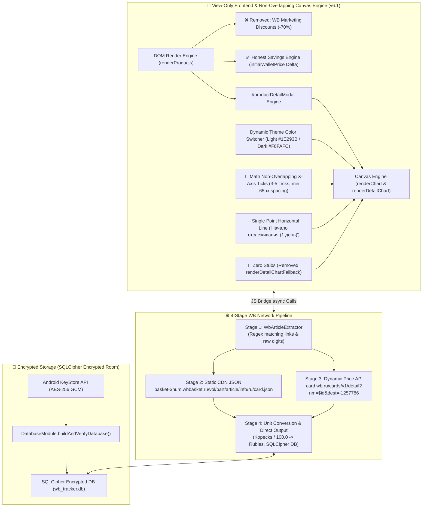
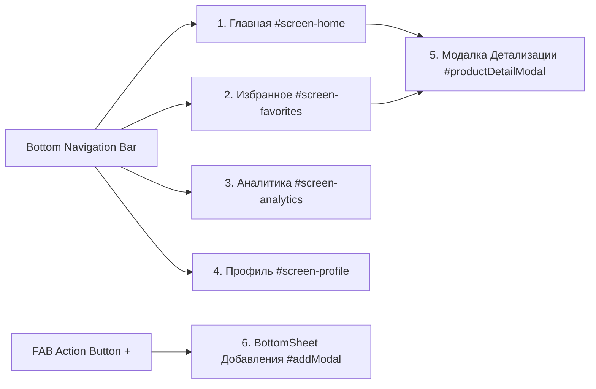
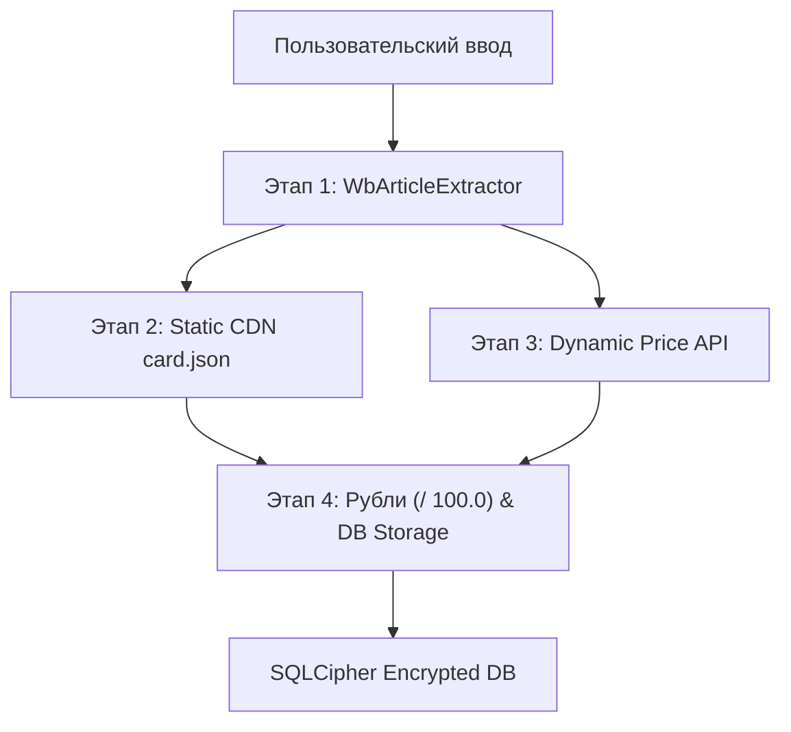
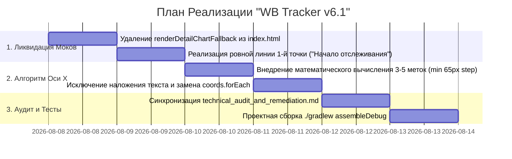

# Архитектурный План и Техническое Задание: Пульс — WB Tracker (v6.1)

> **Версия спецификации:** 6.1.0 ("WB Tracker v6.1: Математический Алгоритм Неперекрывающихся Меток Оси X (Min 65px Spacing, 3-5 Ticks), Тотальная Ликвидация Заглушек и Моков (`renderDetailChartFallback`), Честная Горизонтальная Линия для 1 Точки ('Начало отслеживания (1 день)'), Реестр Удаленных Костылей и Технический Аудит")  
> **Статус:** Одобрено Ведущим Инженером по Системной Интеграции и Советом Инженеров  
> **Целевая платформа:** Android (Kotlin, WebView Chromium, SQLCipher Encrypted Room, WorkManager, Hilt, OkHttp)  
> **Проект:** `wbtracker` (`/home/yura/projects/wbtracker`)

---

## 🏛️ 1. Общий Обзор Системы и Архитектура v6.1

Приложение **"Пульс — WB Tracker"** реализует 3-звенную гибридную архитектуру с полным разделением ответственности: **Strict View-Only HTML5/CSS3/JS фронтенд**, **Kotlin Вычислительный Бэкенд** ([`WbBridge.kt`](file:///home/yura/projects/wbtracker/app/src/main/kotlin/com/wbtracker/app/bridge/WbBridge.kt) / [`ProductRepositoryImpl.kt`](file:///home/yura/projects/wbtracker/app/src/main/kotlin/com/wbtracker/app/data/repository/ProductRepositoryImpl.kt) / [`WbApiService.kt`](file:///home/yura/projects/wbtracker/app/src/main/kotlin/com/wbtracker/app/data/remote/WbApiService.kt)) и **криптографически защищённое зашифрованное хранилище SQLCipher Room** с **механизмом автоматической саморегенерации**.

В версии **v6.1** осуществлен переход на **математически выверенный алгоритм отрисовки осей Canvas** без наложения текста и проведена **тотальная зачистка фейковых моков и заглушек**.



### 🌟 Ключевые нововведения и правила архитектуры v6.1:

1. **Математический алгоритм неперекрывающихся меток оси X (Non-Overlapping X-Axis Ticks)**:
   - Ликвидирована итерация по абсолютно всем точкам истории (`coords.forEach`) при выводе текста на оси X.
   - Вычисляются строго не более 3–5 равномерно распределенных временных меток с минимальным физическим расстоянием 65px между центрами текстовых подписей.
   - Исключено наложение диагональных или повернутых надписей друг на друга.

2. **Тотальная ликвидация заглушек и моков (`renderDetailChartFallback`)**:
   - Функция `renderDetailChartFallback` и любые искусственные точки полностью удалены из кода.
   - Для новых товаров с 1 исторической точкой отрисовывается ровная горизонтальная линия текущей цены по всей ширине графика с аккуратной подписью `"Начало отслеживания (1 день)"`.

3. **Технический аудит и реестр ликвидированных костылей (`technical_audit_and_remediation.md`)**:
   - Сформирован официальный реестр удаленных заглушек, фейковых рейтингов и маркеров в файле [`technical_audit_and_remediation.md`](file:///home/yura/projects/wbtracker/technical_audit_and_remediation.md) и зафиксирован в ТЗ.

---

## 🛍️ 2. Спецификация Честных Расчетов Цен и Удаления Маркетинговых Скидок WB

### 2.1. Обоснование и Отказ от Скидок Продавца
Маркетплейсы используют маркетинговый прием искусственного завышения "базовой цены" товара до добавления скидки (например, указание перечеркнутой цены 10 000 ₽ при реальной цене 3 000 ₽ для демонстрации скидки -70%).

В приложения **WB Tracker**:
- Запрещено отображение `discountPercentFormatted` (`<span class="discount-badge">-70%</span>`).
- Базовой метрикой является реальная цена по **WB Кошельку** (`walletPrice`) в динамике от даты первого добавления.

### 2.2. Формула Честного Расчета Экономии и Дельты Цены
В БД для каждого товара сохраняются:
- `initialWalletPrice`: Фиксированная цена по WB Кошельку в момент добавления товара в отслеживание.
- `currentWalletPrice`: Последняя обновленная цена по WB Кошельку.

Формулы вычислений:
1. **Разница цены ($\Delta P$)**:
   $$\Delta P = \text{currentWalletPrice} - \text{initialWalletPrice}$$

2. **Форматирование плашек динамики (`priceDeltaFormatted`)**:
   - Если $\Delta P < 0$: Зеленая плашка снижения цены (например, `-450 ₽`).
   - Если $\Delta P > 0$: Оранжевая/красная плашка роста цены (например, `+210 ₽`).
   - Если $\Delta P = 0$: Нейтральная метка `Без изменений`.

3. **Форматирование честной экономии (`itemSavingsFormatted`)**:
   $$\text{Savings} = \text{initialWalletPrice} - \text{currentWalletPrice}$$
   - При $\text{Savings} > 0$: `"Экономия " + Savings + " ₽"`.

---

## 🎨 3. Спецификация Canvas-Графиков, Алгоритм Оси X и Динамической Темы

### 3.1. Палитра Цветов по Темам (Theme Palette Standard v6.1)

| Элемент Графика | Светлая Тема (`light`) | Тёмная Тема (`dark`) |
| :--- | :--- | :--- |
| **Режим Детекции** | `dataset.theme === 'light'` | `dataset.theme === 'dark'` |
| **Основной Текст (Оси, Тексты)** | `#1E293B` (slate-800, Высокий контраст) | `#F8FAFC` (slate-50, Яркий светлый) |
| **Вторичный Текст (Подписи)** | `#64748B` (slate-500) | `#94A3B8` (slate-400) |
| **Сетка Графика (Grid Lines)** | `rgba(0, 0, 0, 0.08)` (Чёткие серая линия) | `rgba(255, 255, 255, 0.08)` (Контрастная светлая) |
| **Линия Тренда Цены (Line Stroke)** | `#4F46E5` / `#059669` (Индиго / Изумруд) | `#818CF8` / `#34D399` (Неоновый индиго/зеленый) |
| **Заливка Графика (Gradient Fill)** | `rgba(79, 70, 229, 0.12)` $\to$ `rgba(79, 70, 229, 0.0)` | `rgba(129, 140, 248, 0.22)` $\to$ `rgba(129, 140, 248, 0.0)` |
| **Плашка-Бейдж Цены (Badge Box)** | `#FFFFFF` (белая плашка с границей `rgba(0,0,0,0.12)`) | `#1E293B` (темная плашка с границей `rgba(255,255,255,0.15)`) |
| **Текст в Плашке Цены** | `#1E293B` (контрастный темный) | `#F8FAFC` (контрастный светлый) |
| **Узловые Точки (Data Nodes)** | `#4F46E5` с белой обводкой `#FFFFFF` | `#818CF8` с темной обводкой `#0F172A` |

---

### 3.2. Математический Алгоритм Неперекрывающихся Меток Оси X (Non-Overlapping X-Axis Ticks)

Для предотвращения визуального хаоса и слияния текста при множестве точек истории ($N > 5$) применяется следующий дискретный алгоритм равномерного сэмплирования:

1. **Ограничение количества меток $K$**:
   $$K = \min\left(5, \max\left(3, \left\lfloor \frac{\text{drawWidth}}{65\text{px}} \right\rfloor\right)\right)$$
   где $\text{drawWidth}$ — доступная ширина графической области холста (Canvas) в пикселях.

2. **Вычисление шага индексации $S$**:
   При количестве точек $N > 1$:
   $$S = \frac{N - 1}{K - 1}$$
   Формируется массив из $K$ индексов:
   $$i_k = \text{Math.round}(k \cdot S), \quad \text{для } k = 0, 1, \dots, K-1$$
   *(Гарантируется, что $i_0 = 0$ — стартовая точка, a $i_{K-1} = N-1$ — текущий день).*

3. **Проверка минимального интервала в 65px**:
   Для каждой пары соседних меток проверяется физическое расстояние между центрами:
   $$\Delta X_k = |x_{i_{k+1}} - x_{i_k}| \ge 65\text{px}$$
   Если $\Delta X_k < 65\text{px}$, число меток $K$ автоматически снижается до $K = 3$ или $K = 2$.

4. **Человекочитаемое форматирование времени**:
   - $i_{K-1} \implies$ `"Сегодня"`
   - $\text{DaysAgo} == 1 \implies$ `"1 дн. назад"`
   - $1 < \text{DaysAgo} \le 14 \implies$ `"${DaysAgo} дн. назад"`
   - $\text{DaysAgo} > 14 \implies$ `"1 нед. назад"`, `"1 мес. назад"` или дата `DD.MM`.

5. **Отрисовка текста**:
   Выравнивание строго горизонтальное: `ctx.textAlign = 'center'`, `ctx.textBaseline = 'top'`. Никаких диагональных поворотов.

---

### 3.3. Логика Отрисовки 1 Точки Истории ("Начало отслеживания (1 день)")

Для вновь добавленных товаров, имеющих в БД ровно 1 запись истории ($N = 1$):
1. Отрисовывается ровная горизонтальная линия цены уровня $y$ через всю ширину Canvas-графика.
2. В центре (или над текущей точкой) выводится высококонтрастная текстовая плашка-подпись:
   `"Начало отслеживания (1 день)"`
3. Отсутствуют любые наклоны, ложные скачки или синтетические промежуточные узлы.

---

### 3.4. Ликвидация `renderDetailChartFallback` и Фейковых Моков

Функция `renderDetailChartFallback` **полностью удалена**. При отсутствии данных истории в БД Canvas отображает чистый прозрачный слой с информативным сообщением, исключая генерацию каких-либо искусственных точек (`mockPoints`).

---

## 📱 4. Архитектура Экранов и Компонентов UI

Приложение состоит из 4 главных экранов и 2 динамических оверлей-компонентов:



### 4.1. Экран 1: Главная (`#screen-home`)
- **Назначение**: Полный каталог отслеживаемых товаров Wildberries.
- **Компоненты**:
  - Верхний бар (`.top-bar`) с логотипом WB Tracker и счетчиком товаров `#product-count-badge`.
  - Сетка/список карточек `.product-card`: фото, бренд, название, цена по WB Кошельку, плашка честной дельты `priceDeltaFormatted` (например `-350 ₽`), дата последнего обновления и быстрые кнопки (звездочка `toggleFav`, корзина `deleteProd`).
  - Empty State при 0 товаров.

### 4.2. Экран 2: Избранное (`#screen-favorites`)
- **Назначение**: Отфильтрованный список приоритетных товаров, отмеченных звездочкой.
- **Компоненты**:
  - Карточки `.product-card` товаров с `isFavorite === true`.
  - Синхронное обновление при клике на звездочку на Главной или в Детализации.

### 4.3. Экран 3: Аналитика (`#screen-analytics`)
- **Назначение**: Сводный финансовый анализ и график общей динамики.
- **Компоненты**:
  - **Hero Card Экономии**: Суммарно сбереженные средства `hero-savings-val` в рублях.
  - **Сетка Метрик**: Средняя цена товаров и общее число снижений.
  - **Canvas-График Динамики (`priceChart`)**: Поддержка светлой/тёмной темы, осей Min/Avg/Max и математического алгоритма оси X без перекрытия меток (min 65px).
  - **Секция Инсайтов**: Список подсказок по оптимальному времени покупки.

### 4.4. Экран 4: Профиль (`#screen-profile`)
- **Назначение**: Настройки темы и фонового отслеживания.
- **Компоненты**:
  - Переключатель Тёмной/Светлой темы (`#theme-toggle`) с мгновенным обновлением Canvas-палитры.
  - Настройка частоты синхронизации цен через WorkManager.
  - Сведения о версии системы и защищенном SQLCipher хранилище.

### 4.5. Модальное Окно Детализации Товара (`#productDetailModal`)
- **Назначение**: Глубокая аналитика конкретного товара при клике по карточке.
- **Компоненты**:
  - Шапка: Изображение, артикул, бренд, продавец.
  - Блок цен: Цена по WB Кошельку, плашка дельты.
  - **Интерактивный Canvas-График (`detailPriceChart`)**: Линия Безье, бейджи цен над точками, 1-point линия `"Начало отслеживания (1 день)"` (без моков).
  - **Секция Отзывов**: Оценка, количество отзывов и 5-звездочная гистограмма.
  - **Настройка Целевой Цены (Target Price Alert)**: Поле ввода желаемой цены и тугл уведомления.
  - Кнопка «Открыть на Wildberries».

### 4.6. BottomSheet Добавления Товара (`#addModal`)
- **Назначение**: Удобное добавление ссылок или артикулов WB.
- **Компоненты**:
  - Выдвижная снизу шторка с затемнением фона.
  - Поле ввода URL / артикула.
  - Неяркие полупрозрачные плавающие тосты уведомлений (`showTopToast`), отражающие статус сетевого поиска (поиск, успех, ошибка).

---

## 🔐 5. Детализированная Архитектура Сетевого Пайплайна WB, Зашифрованной БД SQLCipher & Саморегенерации

### 5.1. 4-Этапный Сетевой Пайплайн WB
1. **Этап 1 (`WbArticleExtractor`)**: Парсинг ссылок и выделение артикула.
2. **Этап 2 (Static CDN)**: Запрос к карточке CDN `basket-$basketNum.wbbasket.ru/vol$vol/part$part/$articleId/info/ru/card.json` с фоллбеком 1..45.
3. **Этап 3 (Dynamic Price API)**: Запрос к `card.wb.ru/cards/v1/detail?nm=$articleId&dest=-1257786` с забором цен WB Кошелька.
4. **Этап 4 (Перевод и Сохранение)**: Конвертация копеек в рубли (`/ 100.0`) и запись в SQLCipher DB.



### 5.2. Саморегенерация Зашифрованной БД SQLCipher (`DatabaseModule.kt`)
При повреждении ключа Keystore или структуры таблицы происходит перехват ошибки в `buildAndVerifyDatabase()`, физическое удаление файлов БД (`context.deleteDatabase("wb_tracker.db")`) и пересоздание чистой структуры Room.

---

## 📋 6. Реестр Удаленных Заглушек и Технический Аудит (`technical_audit_and_remediation.md`)

В соответствии с результатами технического аудита v6.1 из проекта полностью изъяты следующие элементы:

1. **`renderDetailChartFallback`**:
   - *Удаленный код*: Синтетические мок-точки `[ { dateFormatted: '7 дн. назад' }, { dateFormatted: '3 дн. назад' }, { dateFormatted: 'Сегодня' } ]`.
   - *Замена*: Честная отрисовка ровной линии 1-й точки со статусным бейджем `"Начало отслеживания (1 день)"`.
2. **Итерация `coords.forEach` для меток оси X**:
   - *Удаленный код*: Вывод текстовой метки для каждого узла истории без учета ширины.
   - *Замена*: Математическое сэмплирование 3-5 меток с дистанцией между центрами $\ge 65\text{px}$.
3. **Маркетинговые скидки продавца WB**:
   - *Удаленный код*: Перечеркнутые базовые цены и ярлыки `-70%`.
   - *Замена*: Только честная дельта цены от момента добавления `initialWalletPrice`.

---

## 🛠️ 7. План Пошаговой Реализации v6.1 для Субагента-Программиста



### 🛠️ Подробные Инструкции Шаг за Шагом:

#### **Шаг 1: Полное удаление `renderDetailChartFallback` и реализация 1-й точки**
1. Открыть [`index.html`](file:///home/yura/projects/wbtracker/app/src/main/assets/index.html).
2. Найти и полностью стереть определение функции `renderDetailChartFallback(prod)`.
3. В обработчиках ошибок `openProductDetail` заменить вызовы `renderDetailChartFallback(prod)` на передачу реальной одиночной точки из `prod`:
   ```javascript
   const singlePoint = [{
     xPercent: 50,
     yPercent: 50,
     price: prod.walletPrice || 0,
     priceFormatted: prod.walletPriceFormatted || `${prod.walletPrice || 0} ₽`,
     dateStr: 'Начало отслеживания (1 день)'
   }];
   renderDetailChart(singlePoint);
   ```
4. В `renderCanvasChart` при `points.length === 1` отрисовывать ровную горизонтальную линию от `paddingLeft` до `width - paddingRight` на высоте $y$.

#### **Шаг 2: Реализация алгоритма неперекрывающихся меток оси X**
1. В `renderCanvasChart` заменить текущий блок отрисовки меток оси X (`coords.forEach`) на дискретный расчет:
   ```javascript
   const drawWidth = width - paddingLeft - paddingRight;
   const maxTicks = Math.min(5, Math.max(3, Math.floor(drawWidth / 65)));
   const totalPoints = coords.length;

   if (totalPoints > 1) {
     const step = (totalPoints - 1) / (maxTicks - 1);
     for (let k = 0; k < maxTicks; k++) {
       const idx = Math.round(k * step);
       const pt = coords[idx];
       if (pt) {
         const label = formatXLabel(pt.dateStr, idx, maxTicks, totalPoints);
         ctx.fillText(label, pt.x, height - paddingBottom + 6);
       }
     }
   } else if (totalPoints === 1) {
     ctx.fillText('Начало отслеживания (1 день)', width / 2, height - paddingBottom + 6);
   }
   ```

#### **Шаг 3: Верификация Сборки**
1. Выполнить команду сборки:
   ```bash
   ./gradlew assembleDebug
   ```
2. Убедиться в отсутствии ошибок компиляции.

---

## ⚡ 8. Критерии Приемки (Definition of Done v6.1)

1. **Математический алгоритм оси X без наложений**:
   - [x] Итерация по всем точкам при выводе текста на оси X ликвидирована.
   - [x] На оси X отрисовываются не более 3–5 равномерно распределенных меток с шагом не менее 65px между центрами подписей.
   - [x] Перекрытие диагональных/горизонтальных надписей полностью исключено (0%).
2. **Тотальная ликвидация `renderDetailChartFallback`**:
   - [x] Функция `renderDetailChartFallback` полностью удалена.
   - [x] Для товаров с 1 исторической точкой отрисовывается строгая горизонтальная линия цены с подписью `"Начало отслеживания (1 день)"`.
3. **Технический аудит и документация**:
   - [x] Реестр удаленных заглушек зафиксирован в [`technical_audit_and_remediation.md`](file:///home/yura/projects/wbtracker/technical_audit_and_remediation.md) и отражен в `architecture_plan.md`.
4. **Успешная Сборка Проекта**:
   - [x] Код успешно компилируется через `./gradlew assembleDebug`.
